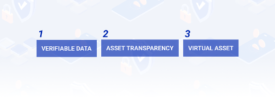
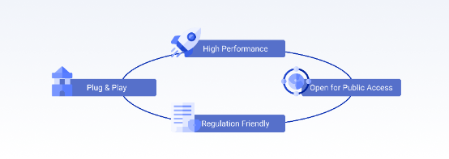

# POTOS文档目录

## Concepts

### What is POTOS?

[https://docs.potos.hk/en/latest/concepts/index.html#what-is-potos](https://docs.potos.hk/en/latest/concepts/index.html#what-is-potos)

POTOS(Portal of the Orient Symposium) is a cutting-edge Layer 1 blockchain platform built for the web3.0 era.

We focus on:

- **Verifiable Data:** Ensuring every transaction is auditable and secure, ideal for applications like finance and supply chain management.

- **Asset Transparency:** Providing full visibility into tokenized assets, enhancing traceability and accountability.

- **Support for Stablecoins and Virtual Assets:** Offering tools to manage and transact stablecoins, fostering innovation in DeFi and digital payments.

Built on the FISCO BCOS framework, POTOS is Solidity-compatible, integrating seamlessly with Ethereum ecosystems. Designed for regulatory compliance, our platform stands out as a secure, transparent, and versatile solution for modern enterprises and regulatory needs.

Join us in transforming the digital economy with POTOS!

- **Core Pillars**

- **Verifiable Data**

POTOS is committed to making data truly verifiable. With every transaction designed for easy auditing and traceability, we ensure top-notch trust and reliability. Using cutting-edge cryptographic techniques, POTOS protects data integrity and minimizes tampering risks. This focus on transparency makes us the perfect fit for applications needing strict validation, like finance, supply chain management, and regulatory compliance.

- **Asset Transparency**

POTOS revolutionizes asset transparency, giving stakeholders complete visibility into tokenized assets. Our decentralized ledger provides real-time insights into ownership and movements, ensuring traceability and accountability. This minimizes risks and offers a secure platform for confident asset management. With detailed, immutable records, POTOS enhances operational integrity and creates a trusted environment for transparent asset management.

- **Support for Stablecoins and Virtual Assets**

POTOS is built to embrace the rise of stablecoins and virtual assets. Our platform provides all the tools you need to issue, manage, and trade stablecoins efficiently. With a robust architecture, POTOS seamlessly integrates virtual assets, serving as a versatile foundation for DeFi, digital payments, and tokenized ecosystems. We're your reliable partner for driving financial innovation in the digital economy.

POTOS is built with a flexible framework that keeps up with evolving digital asset regulations. By integrating core pillars, we offer a secure, transparent, and versatile blockchain solution for innovative enterprises and regulatory bodies in today’s fast-paced digital world.

 

### What is FISCO BCOS?

[https://docs.potos.hk/en/latest/concepts/index.html#what-is-fisco-bcos](https://docs.potos.hk/en/latest/concepts/index.html#what-is-fisco-bcos)

FISCO BCOS is a next-generation ope-source blockchain infrastructure optimized for the web3.0 economy. Built to financial-grade standards, FISCO BCOS features a highly open network with robust web3.0 capabilities and seamless user experience, all of which are engineered for laying a solid foundation for the development of Hong Kong's web3.0 ecosystem.

**FISCO BCOS offers several key advantages:**

- **High Performance:** FISCO BCOS utilizes an advanced Block-Level Pipelining (BLP) architecture and Deterministic Multi-Contract (DMC) technologies, which enables secure block production and transaction validation within a second. Such performance and security makes FISCO BCOS perfectly suited for business settings that entail large transaction volumes, such as online payments.

- **Open for Public Access:** FISCO BCOS defines various types of nodes and invites different participants to join as consensus, data, and application nodes. This open design sows the seeds for a vibrant and inclusive ecosystem with clear oversight.

- **Plug & Play:** FISCO BCOS seamlessly integrates with the Ethereum Virtual Machine (EVM) and supports Solidity smart contracts. This allows developers to use popular tools like MetaMask, Remix, and Hardhat to build applications on the platform with ease. Added to that, FISCO BCOS also offers extensive toolkits for Decentralized Identity (DID), Cross-Chain, Oracles, and other development needs.

- **Regulation Friendly:** FISCO BCOS comes with integrated KYB (Know Your Business) and KYT (Know Your Transaction) functionalities, facilitating institution onboarding, contract approval, and transaction auditing. It provides versatilegovernance tools and a compliance monitoring platform, empowering businesses and developers to operate efficiently within regulatory frameworks.

  With its financial-grade capabilities, regulator friendly architecture, extensive developer support, and dynamic ecosystem, FISCO BCOS presents a reliable choice for Hong Kong's web3.0 infrastructure.

  Built upon FISCO BCOS, POTOS offers developers a platform with limitless innovation potential and supports the digital transformation of enterprises. Together, this opens up possibilities for a wide range of applications such as stablecoins, NFTs, DePin, and RWA, nurturing a trusted and sustainable digital economy.

 

 

### Glossary

- #### Accounts
    [https://docs.potos.hk/en/latest/glossary/accounts.html](https://docs.potos.hk/en/latest/glossary/accounts.html)

- #### Transactions
    [https://docs.potos.hk/en/latest/glossary/transactions.html](https://docs.potos.hk/en/latest/glossary/transactions.html)

- #### Transaction fees
    [https://docs.potos.hk/en/latest/glossary/transaction-fees.html](https://docs.potos.hk/en/latest/glossary/transaction-fees.html)

- #### Nodes
    [https://docs.potos.hk/en/latest/glossary/nodes.html](https://docs.potos.hk/en/latest/glossary/nodes.html)

- #### Consensus algorithm
    [https://docs.potos.hk/en/latest/glossary/consensus.html](https://docs.potos.hk/en/latest/glossary/consensus.html)

<!-- - #### DAO ----无 -->

## Developer

- ### Configuration
    [https://docs.potos.hk/en/latest/developer/config.html](https://docs.potos.hk/en/latest/developer/config.html)

- ### Explorer

    [https://docs.potos.hk/en/latest/developer/explorer_usage.html
](https://docs.potos.hk/en/latest/developer/explorer_usage.html)

- ### Wallet

    [https://docs.potos.hk/en/latest/developer/wallet_usage.html
](https://docs.potos.hk/en/latest/developer/wallet_usage.html)

- ### Connecting Remix to FISCO BCOS

    [https://docs.potos.hk/en/latest/developer/remix_usage.html
](https://docs.potos.hk/en/latest/developer/remix_usage.html)

- ### Deploy smart contract using Hardhat

    [https://docs.potos.hk/en/latest/developer/hardhat_usage.html
](https://docs.potos.hk/en/latest/developer/hardhat_usage.html)

## Community

<!-- - ### DAO----无？
  介绍一下Dao机制

- ### Roles----无？
  委员会机制，有什么角色 / 功能。。。。 -->

- ### Participate 

  [https://docs.potos.hk/en/latest/community/participate.html](https://docs.potos.hk/en/latest/community/participate.html)

- ### GitHub
  [https://github.com/FISCO-BCOS/FISCO-BCOS](https://github.com/FISCO-BCOS/FISCO-BCOS)

  [https://github.com/WeTechHK/bcos-dao](https://github.com/WeTechHK/bcos-dao)

  [https://github.com/potoshk/blockscout](https://github.com/potoshk/blockscout)

  [https://github.com/potoshk/blockscout-frontend](https://github.com/potoshk/blockscout-frontend)
  

## More on the way ...

 

