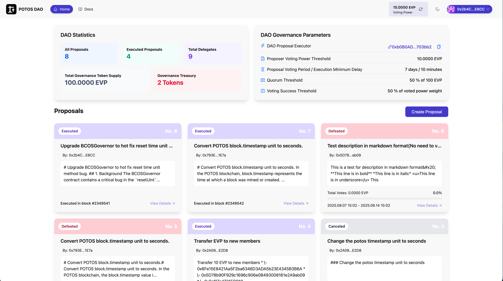
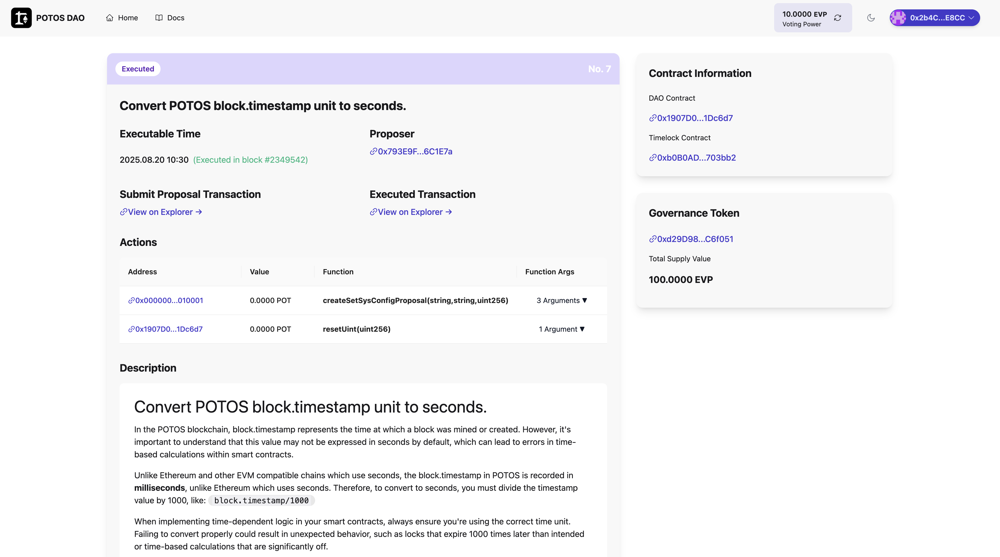
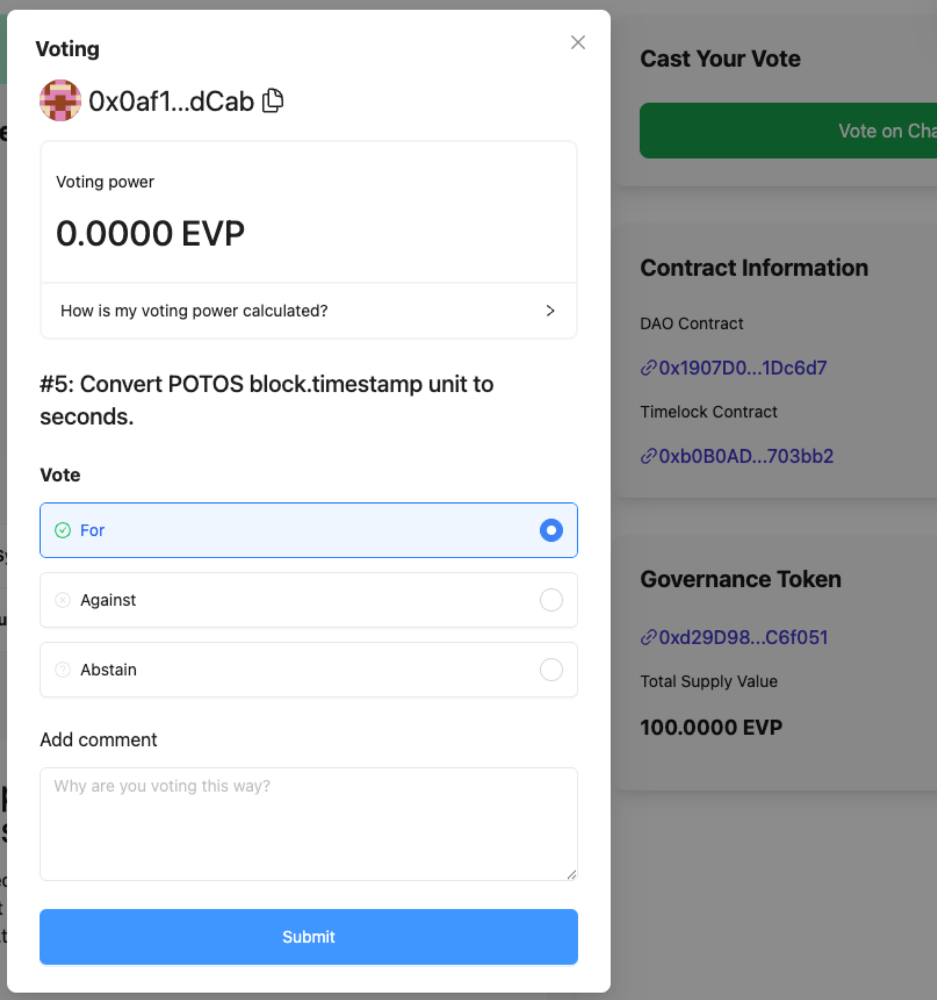
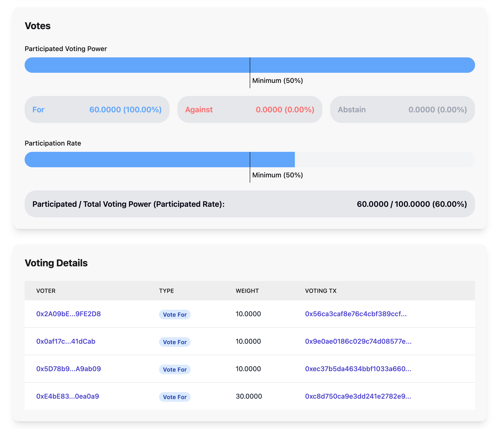
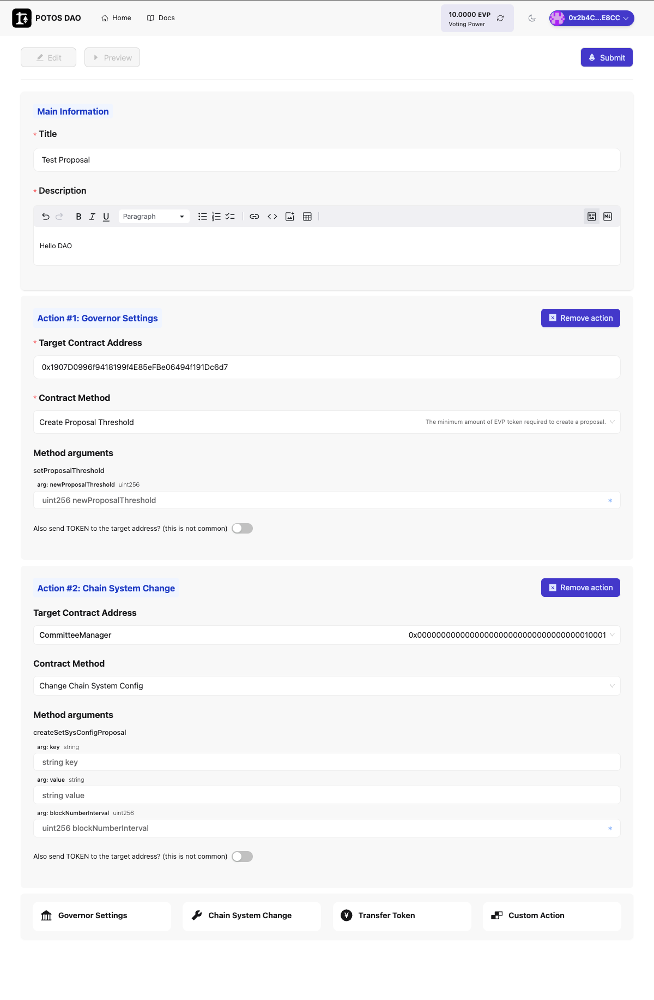

# Participate in DAO Governance

This guide explains how to participate in POTOS DAO governance. The POTOS DAO is implemented using contracts based on **OpenZeppelin Governance**, providing transparent, on-chain proposal creation, voting, and execution.

## 1. Introduction

### 1.1 What is a DAO?

A **DAO (Decentralized Autonomous Organization)** is an organization whose rules and operations are encoded in smart contracts and enforced on the blockchain. Key characteristics include:

- **Decentralization:** No single party controls decisions; governance is distributed among token holders.
- **Transparency:** Proposals, votes, and execution are recorded on-chain and can be verified by anyone.
- **Community-driven:** Holders of the governance token (EVP on POTOS) can propose changes and vote on them.
- **Automated execution:** Approved proposals are executed by smart contracts after a timelock delay, without relying on a central operator.

### 1.2 Why Participate in DAO Governance?

- **Direct influence:** Your voting power reflects your stake; you can shape protocol parameters, upgrades, and treasury usage.
- **Aligned incentives:** Governance participants are invested in the long-term health of the project.
- **Learning:** You gain hands-on experience with on-chain governance and OpenZeppelin-style workflows.

### 1.3 What You Can Do in the POTOS DAO App

- Browse and filter proposals (Executed, Defeated, Canceled, etc.).
- View detailed proposal content, execution details, and on-chain actions.
- Cast votes (For, Against, Abstain) and optionally add a comment.
- Create new proposals with one or more on-chain actions (governor settings, chain config, token transfer, or custom calls).
- Track your voting power (EVP) and delegation.

## 2. Preparation

### 2.1 Account and Wallet

- Create or use an Ethereum-compatible wallet (e.g., MetaMask).
- Connect the wallet to the POTOS network. See [Connect to the network](connect_network.md) for adding the chain and connecting your wallet.

### 2.2 Governance Token (EVP)

- **EVP** is the governance token used for voting and proposal creation on POTOS DAO.
- Your **voting power** is determined by your EVP balance (and any delegation you receive). The app displays it in the header (e.g., "10.0000 EVP Voting Power").
- To **create a proposal**, you must hold at least the **Proposer Voting Power Threshold** (e.g., 10 EVP as shown in the DAO parameters). To **vote**, you need a positive voting power at the time of the vote.

### 2.3 Delegation

- You can **delegate** your voting power to another address (or to yourself to activate voting). Delegation does not transfer token ownership.
- Delegation types: full delegation to one address, partial delegation, or self-delegation to participate with your own balance.
- You can change or revoke delegation at any time. Delegation affects how much voting power counts when you (or your delegate) vote.

## 3. DAO Home and Dashboard

From the DAO home page you can see an overview of the DAO’s activity and key parameters, and access the list of proposals.

### 3.1 DAO Statistics

The left card shows aggregate metrics, for example:

- **All Proposals:** Total number of proposals submitted.
- **Executed Proposals:** Number of proposals that have been successfully executed on-chain.
- **Total Delegates:** Number of addresses that have been delegated (or self-delegated) and can participate.
- **Total Governance Token Supply:** Total EVP supply (e.g., 100 EVP).
- **Governance Treasury:** Number of tokens (or assets) held by the DAO treasury.

### 3.2 DAO Governance Parameters

The right card summarizes the rules that govern proposals and voting (aligned with OpenZeppelin Governor concepts):

- **DAO Proposal Executor (Timelock):** Contract address that executes approved proposals after a delay. This is the Timelock contract in the OpenZeppelin Governance model.
- **Proposer Voting Power Threshold:** Minimum EVP required to create a proposal (e.g., 10 EVP).
- **Proposal Voting Period / Execution Minimum Delay:** How long voting lasts (e.g., 7 days) and the minimum delay before execution (e.g., 10 minutes).
- **Quorum Threshold:** Minimum share of total voting power that must participate (e.g., 50% of 100 EVP) for the vote to be valid.
- **Voting Success Threshold:** Share of *participated* voting power that must vote “For” for the proposal to pass (e.g., 50% of voted power weight).

A **Create Proposal** button is available for users who meet the proposer threshold.

### 3.3 Proposal List

The bottom section lists proposals in cards. Each card typically shows:

- **Status:** Executed, Defeated, Canceled, etc.
- **Proposal number** (e.g., No. 8, No. 7).
- **Title** and **author** (proposer address).
- A short description and status-specific info (e.g., “Executed in block #2349541” or “Total Votes: X EVP” and voting period).
- A **View Details** link to the full proposal page.

Use this list to browse proposals and open the ones you want to read or vote on.

## 4. Browsing and Understanding Proposals

### 4.1 Proposal Statuses

Proposals in the list and detail views use statuses consistent with OpenZeppelin Governor-style lifecycles:

- **Active / Pending:** Proposal is in the voting period; you can cast a vote.
- **Defeated:** Voting ended and the proposal did not reach quorum or the success threshold (e.g., not enough “For” votes).
- **Succeeded:** Voting ended and the proposal met quorum and the success threshold; it can be queued for execution.
- **Queued:** Proposal is queued in the Timelock; it will become executable after the execution delay.
- **Executed:** The proposal’s actions have been executed on-chain.
- **Canceled:** Proposal was canceled and will not be executed.

### 4.2 Opening a Proposal

Click **View Details** on a proposal card to open the **Proposal Details** page, where you can read the full description, see execution information (for executed proposals), and inspect on-chain actions and transactions.

## 5. Proposal Details Page

The proposal details page shows everything about a single proposal: status, timing, proposer, transactions, and the exact on-chain actions that were (or will be) executed.

### 5.1 Header and Status

- A status tag (e.g., **Executed**, **Defeated**, **Canceled**) indicates the current state.
- The proposal **number** (e.g., No. 7) and **title** are shown at the top.

### 5.2 Execution and Proposer Information

For executed proposals you will see:

- **Executable Time:** When the proposal was executed (e.g., 2025.08.20 10:30).
- **Block reference:** “Executed in block #2349542” with a link to the block explorer.
- **Proposer:** The address that created the proposal (e.g., 0x793E9F...6C1E7a), often linked to the explorer.

### 5.3 Transactions

- **Submit Proposal Transaction:** Link to the transaction that submitted the proposal to the Governor contract.
- **Executed Transaction:** Link to the transaction that executed the proposal (for executed proposals).

### 5.4 Actions Table

The **Actions** table lists the on-chain calls that the proposal performs. Each row typically includes:

- **Address:** The target contract (e.g., system contract 0x0000...010001 or the DAO contract 0x1907D0...1Dc6d7).
- **Value:** Amount of native token (e.g., POT) sent with the call (often 0).
- **Function:** The function name (e.g., `createSetSysConfigProposal(string, string, uint256)`, `resetUint(uint256)`).
- **Function Args:** Number of arguments; you can expand to see the actual values.

This mirrors the “calldata” that the Governor forwards to the Timelock and then to the target contracts.

### 5.5 Description

The **Description** section contains the human-readable explanation of the proposal (purpose, context, and any technical notes). For example, a proposal might explain that POTOS uses `block.timestamp` in milliseconds and that developers should divide by 1000 when comparing to seconds.

### 5.6 Sidebar: Contracts and Token

The right sidebar often shows:

- **DAO Contract:** The Governor contract address.
- **Timelock Contract:** The executor (Timelock) address.
- **Governance Token:** Token contract address and total supply (e.g., 100 EVP).

Use these to verify contracts on the block explorer or in your own tools.

## 6. Voting on a Proposal

When a proposal is in the **Active** (voting) state, you can cast your vote from the proposal page.

### 6.1 Opening the Voting Modal

Click the **Vote on Chain** (or equivalent) button. A **Voting** modal appears.

### 6.2 Voting Modal Contents

- **Your wallet:** The connected address (e.g., 0x0af1...dCab) is shown at the top.
- **Voting power:** Your current EVP voting power for this proposal (e.g., 0.0000 EVP or 10.0000 EVP). If you have no voting power, you cannot submit a vote. A link such as “How is my voting power calculated?” may explain delegation and balance.
- **Proposal context:** The proposal number and title (e.g., “#5: Convert POTOS block.timestamp unit to seconds.”).
- **Vote options:**
  - **For:** You support the proposal.
  - **Against:** You oppose the proposal.
  - **Abstain:** You participate but do not support or oppose; abstain votes count toward quorum but not toward the “For” majority.
- **Comment (optional):** You can add a short reason (e.g., “Why are you voting this way?”) for transparency.
- **Submit:** Click to sign and submit the vote transaction. Your vote is recorded on-chain.

### 6.3 After Voting

Once the transaction is confirmed, your choice (For/Against/Abstain) and weight are reflected in the **Voting Details** / vote breakdown section. Votes are final and cannot be changed for that proposal.

## 7. Viewing Voting Results

The **Voting Details** (or votes) section for a proposal shows how much voting power participated and how it was split between For, Against, and Abstain.

### 7.1 Participated Voting Power

- A progress bar shows how much of the total voting power has participated.
- A **Minimum (50%)** line indicates the quorum threshold. If the bar does not reach this line, the proposal typically does not pass (quorum not met).
- Below the bar, three boxes summarize:
  - **For:** Total weight and percentage of *participated* power (e.g., 60.0000 EVP, 100%).
  - **Against:** Weight and percentage (e.g., 0.0000 EVP, 0%).
  - **Abstain:** Weight and percentage (e.g., 0.0000 EVP, 0%).

### 7.2 Participation Rate

- Another bar (and text) shows **Participated / Total Voting Power** and the participation rate (e.g., 60.0000 / 100.0000 EVP, 60%).
- The **Minimum (50%)** line again indicates the quorum. A proposal only passes if both quorum and the success threshold (e.g., &gt;50% of participated power voting For) are met.

### 7.3 Voting Details Table

A table lists each vote:

- **VOTER:** Voter address (often truncated, with a link to the explorer).
- **TYPE:** Vote For, Vote Against, or Abstain.
- **WEIGHT:** Voting power cast (e.g., 10.0000, 30.0000 EVP).
- **VOTING TX:** Transaction hash of the vote, for on-chain verification.

This gives a full, auditable view of who voted and how much weight they had.

## 8. Creating a Proposal

If you hold at least the **Proposer Voting Power Threshold** (e.g., 10 EVP), you can create a new proposal from the DAO home (**Create Proposal**) or the dedicated create page.

### 8.1 Main Information

- **Title (required):** Short, clear title (e.g., “Test Proposal”).
- **Description (required):** Full explanation in rich text (markdown-supported). Include purpose, impact, and any technical details so voters can evaluate the proposal.

You can switch between **Edit** and **Preview** to review how the description will look.

### 8.2 Adding Actions

A proposal can include **one or more on-chain actions**. Each action targets a contract and calls a specific function with given arguments. The UI typically lets you add actions from these types:

- **Governor Settings:** Change parameters of the Governor contract (e.g., proposal threshold, voting delay, voting period). You must specify:
  - **Target Contract Address:** Usually the DAO (Governor) contract (e.g., 0x1907D0...1Dc6d7).
  - **Contract Method:** e.g., “Create Proposal Threshold” (`setProposalThreshold`). Helper text may state: “The minimum amount of EVP token required to create a proposal.”
  - **Method arguments:** e.g., `newProposalThreshold` (uint256). Enter the value in the field.
- **Chain System Change:** Propose changes to chain system config via the CommitteeManager or system contract. You must specify:
  - **Target Contract Address:** e.g., CommitteeManager at 0x0000...010001.
  - **Contract Method:** e.g., “Change Chain System Config” (`createSetSysConfigProposal`).
  - **Method arguments:** e.g., `key` (string), `value` (string), `blockNumberInterval` (uint256).
- **Transfer Token:** Send tokens from the DAO treasury to a recipient (target address and method as shown in the UI).
- **Custom Action:** Call an arbitrary contract with address, function, and arguments.

For each action you can choose whether to **send TOKEN** to the target (usually left off). Use **Remove action** to delete an action you added by mistake.

### 8.3 Submitting the Proposal

- Review title, description, and all actions.
- Click **Submit** to send the transaction that creates the proposal. You may need to confirm in your wallet and pay gas.
- After confirmation, the proposal appears in the list and enters the **voting period** according to the DAO’s parameters (e.g., 7 days). Once the period ends, if the proposal **Succeeds**, it can be queued and then executed after the Timelock delay.

## 9. Governance Parameters Summary

Understanding these parameters (shown on the DAO home and in the app) helps you know when you can propose, how long voting lasts, and what is required for a proposal to pass:

| Parameter | Meaning |
|-----------|--------|
| **Proposer Voting Power Threshold** | Minimum EVP required to create a proposal. |
| **Voting Period** | Duration during which votes can be cast (e.g., 7 days). |
| **Execution Minimum Delay** | Minimum time between a proposal succeeding and being executable (e.g., 10 minutes), enforced by the Timelock. |
| **Quorum Threshold** | Minimum fraction of total voting power that must participate (e.g., 50% of 100 EVP). |
| **Voting Success Threshold** | Minimum fraction of *participated* voting power that must vote “For” for the proposal to pass (e.g., 50% of voted power weight). |

These concepts align with OpenZeppelin’s Governor and GovernorSettings (quorum, voting period, proposal threshold) and TimelockController for execution delay.

## 10. Frequently Asked Questions

**Can I change my vote after submitting?**  
No. Once a vote is submitted on-chain, it is final for that proposal.

**What if I don’t vote?**  
Your voting power simply does not count toward quorum or toward For/Against. If too few people vote, the proposal may not reach quorum and will be Defeated.

**What are the conditions for a proposal to pass?**  
Typically: (1) Voting period has ended, (2) Quorum is met (enough total voting power participated), and (3) The “For” votes exceed the success threshold (e.g., &gt;50% of participated power). Then the proposal can be queued and, after the Timelock delay, executed.

**Is it safe to connect my wallet?**  
Only connect to the official DAO app and verify the URL. Never share your seed phrase or private key. Voting and creating proposals require signing transactions; review each transaction in your wallet before confirming.

## 11. Best Practices

- **Read proposals carefully:** Check the description and the **Actions** table so you understand what will be executed on-chain.
- **Participate consistently:** Voting and delegating increase the legitimacy of governance and help reach quorum.
- **Use comments when voting:** Optional comments help the community understand different viewpoints.
- **Secure your wallet:** Use a dedicated wallet for governance if possible, and keep keys and recovery phrases secure.

## 12. Support and Feedback

- Use the **Docs** link in the DAO app for more documentation.
- Reach out through official community channels (e.g., forum, Discord, Telegram) for questions or issues.
- Report bugs or suggest improvements via the project’s issue tracker or community channels.
