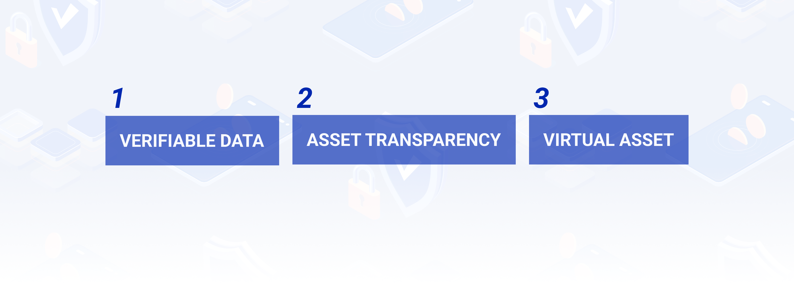

---
myst:
  html_meta:
    "description lang=en": |
      Basic concepts of POTOS.
---

# Concepts

## What is POTOS?

POTOS(Portal of the Orient Symposium) is a cutting-edge Layer 1 blockchain platform built for the Web3.0 era.

### We Focus On

**Verifiable Data**: Ensuring every transaction is auditable and secure, ideal for applications like finance and supply chain management.

**Asset Transparency**: Providing full visibility into tokenized assets, enhancing traceability and accountability.

**Support for Stablecoins and Virtual Assets**：Offering tools to manage and transact stablecoins, fostering innovation in DeFi and digital payments.
Built on the FISCO BCOS framework, POTOS is Solidity-compatible, integrating seamlessly with Ethereum ecosystems. Designed for regulatory compliance, our platform stands out as a secure, transparent, and versatile solution for modern enterprises and regulatory needs.
Join us in transforming the digital economy with POTOS!

### Core Pillars

**Verifiable Data**

POTOS is committed to making data truly verifiable. With every transaction designed for easy auditing and traceability, we ensure top-notch trust and reliability. Using cutting-edge cryptographic techniques, POTOS protects data integrity and minimizes tampering risks. This focus on transparency makes us the perfect fit for applications needing strict validation, like finance, supply chain management, and regulatory compliance.

**Asset Transparency**

POTOS revolutionizes asset transparency, giving stakeholders complete visibility into tokenized assets. Our decentralized ledger provides real-time insights into ownership and movements, ensuring traceability and accountability. This minimizes risks and offers a secure platform for confident asset management. With detailed, immutable records, POTOS enhances operational integrity and creates a trusted environment for transparent asset management.

**Support for Stablecoins and Virtual Assets**

POTOS is built to embrace the rise of stablecoins and virtual assets. Our platform provides all the tools you need to issue, manage, and trade stablecoins efficiently. With a robust architecture, POTOS seamlessly integrates virtual assets, serving as a versatile foundation for DeFi, digital payments, and tokenized ecosystems. We're your reliable partner for driving financial innovation in the digital economy.

POTOS is built with a flexible framework that keeps up with evolving digital asset regulations. By integrating core pillars, we offer a secure, transparent, and versatile blockchain solution for innovative enterprises and regulatory bodies in today’s fast-paced digital world.

## What is FISCO BCOS?

Initiated in 2017 by FISCO (Financial Services Blockchain Consortium (Shenzhen)), FISCO BCOS is an open source blockchain platform created to serve as a trusted infrastructure for the digital economy. Delivering financial-grade performance and security, this open platform has immense potential in unleashing data value to empower industrial digitalization and the Web3.0 economy.

**Financial-Grade Capabilities, Beyond Underpinning Financial Applications**

To efficiently handle large transaction volumes, FISCO BCOS offers >200,000 TPS for a single chain with support for horizontal scaling, easily accommodating the needs of large-scale applications. Such high performance does not come at the cost of security. A comprehensive mechanism is established encompassing cryptographic algorithms, consensus protocols, P2P network, key management, access control and privacy protection to realize 360° security. In addition, the feature of regulatory node enables real-time supervision on the level of nodes, accounts, contracts and transactions on a see-through basis, helping platform users build applications that are more regulator friendly.

**An Open and Universal Platform: All for One, One for All**

Added to full nodes that take part in the consensus process, FISCO BCOS also defines observer nodes and light nodes, via which general users can access the blockchain network to check transaction history, facilitating open participation in the applications on chain. Apart from data transparency, the source code of FISCO BCOS is also fully open source, which in turn gives rise to a wealth of application components through community contributions. Adopting the principle of staying technology agnostic, FISCO BCOS is designed to be fully compatible with mainstream hardware and software platforms covering servers, OS, databases and cryptographic algorithms, making it open to adopters of various IT infrastructure conditions.

With its robust functionality, security, ease of use, and open-source nature, FISCO BCOS has been widely adopted across various industries. It has powered over 500 benchmark applications in finance, e-government, social welfare along with other sectors, effectively promoting industrial digitalization and trusted data circulation. Among those applications, some of them are influential digital infrastructure including the Blockchain Service Network (BSN), Guangdong-Macao/Shenzhen-Hong Kong Cross-Boundary Data Verification Platforms, Sichuan Blockchain Service Infrastructure (ShuXin Chain) as well as instrumental industrial implementations including the NMDIS Big Data & Privacy-Preserving Computing Platform, Pearl River Delta Credit Chain, Banking BaaS (Blockchain as a Service) and Capital Market BaaS.

The "Open Innovation" philosophy has invited numerous partners to join the forming of a thriving ecosystem. As of the end of 2024, the FISCO BCOS open source community has gathered over 5,000 enterprises/institutions and more than 100,000 individual members, making it one of the most vibrant blockchain technology communities in China. In light of its reliable technology and flourishing open source ecosystem, FISCO BCOS has received a number of international and domestic honors, gaining wide recognition from both the industry and academic communities. As the first prize winner of the 2018 Shenzhen Fintech Special Award, FISCO BCOS became the first consortium blockchain platform adopted by BSN in China. In 2022, it was listed in the CIC Approved Blockchain Programs (Professional Grade). In the next year, FISCO BCOS was among the first group of blockchain technology products to be formally certified by the National Financial Technology Certification Center (using national standards JR/T 0184-2020, JR/T 0193-2020 and JR/T 0171-2020). In the international arena, 2 out of 4 Chinese use cases in the Blockchain and Distributed Ledger Technologies – Use Cases (ISO/TR 3242:2022) were based on FISCO BCOS. Alongside, an architecture research paper of FISCO BCOS was accepted by Supercomputing Conference 2023, which is the first paper on blockchain performance optimization at the conference series.

**A Vision for the Future**

As globalization accelerates and enters a deeper phase, FISCO BCOS will continue to break down barriers, transforming its best practices into global de facto standards, empowering digital transformation in more countries and regions, as an ardent commitment to promote the sustainable prosperity of the global digital economy.

**About FISCO** 

Founded by 20+ financial institutions and technology companies including WeBank, Tencent, Shenzhen Fintech Association and Shenzhen Securities Communication in May 2016, FISCO is an NPO that commits to the mission of integrating R&D resources and form synergy in the industry to develop a series of financial-grade blockchain infrastructure and promote an application ecosystem built upon them. With over a hundred member institutions from six major sectors across the country including banking, securities, fund, insurance, equity exchange and technology, FISCO is now one of China’s largest blockchain organizations and also one of the most internationally influential fintech consortiums.