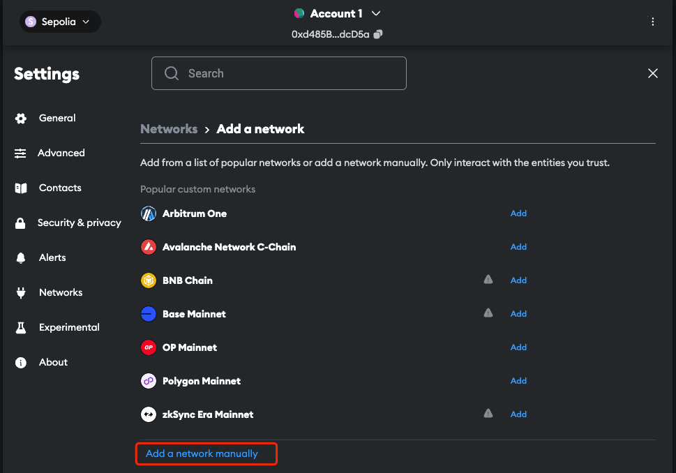
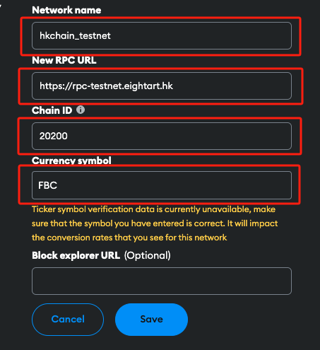
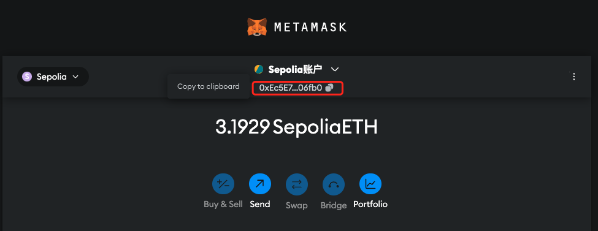
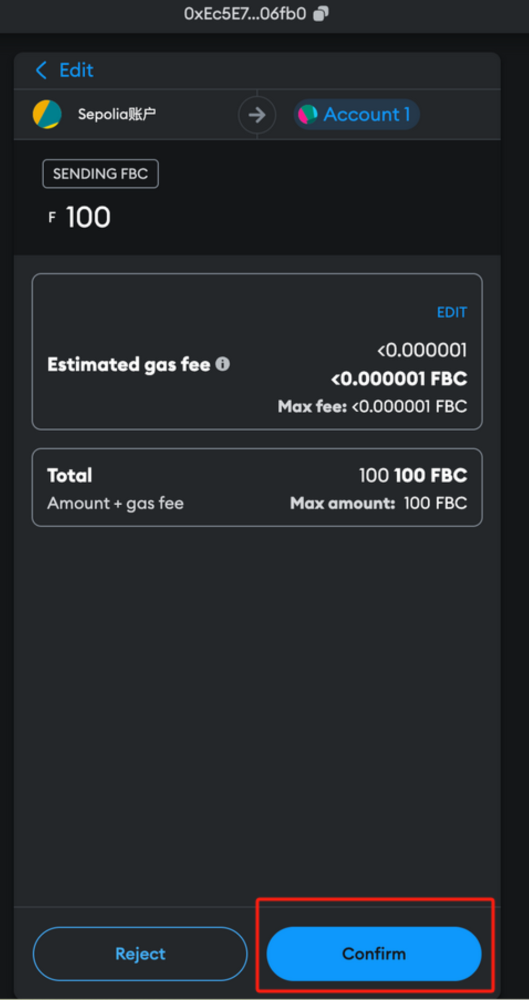

# Guide to connect POTOS Network

## Apply for POTOS "Balance"

### 1\. Create A Wallet

If you do not have a wallet yet, create an account using MetaMask (choose any Ethereum-compatible account type) [here](https://metamask.io/download/). For more information on MetaMask, please refer [here](https://docs.metamask.io/).

### 2\. Connect MetaMask to the POTOS Network

To access the POTOS Network, follow steps below to configure MetaMask:

1. Open the Home page, click dropdown menu in the top-left corner:

  

2. Click "Add a custom network":

  

3. Fill in required information for the POTOS Network and click "Save":

| Entry           | Testnet                   | Mainnet                |
| --------------- | ------------------------- | ---------------------- |
| Network name    | POTOS Testnet             | POTOS Maintest         |
| New RPC URL     | <https://rpc.eightart.hk> | <https://rpc.potos.hk> |
| Chain ID        | 20200                     | 20201                  |
| Currency symbol | FBC                       | FBC                    |



4. You will see the POTOS Network added to the list.


### 3\. Receive POTOS Testnet Tokens

Supply your wallet address [here](https://faucet.eightart.hk/) to get free Testnet faucet funds.

Testnet tokens are crypto assets created on a parallel test network to the Mainnet. Developers use the Testnet to test smart contracts and transactions without risking real-world implications on the Mainnet.

These Testnet tokens work like Mainnet coins, covering gas fees during testing. However, as they are issued in the parallel environment, Testnet tokens have no real-world value on the Mainnet.

You may find your wallet address here:



## Trading with MetaMask Wallet

Once balance is updated, you can start trading on the Testnet.


- To transfer tokens to another wallet address.

  

- Confirm the transaction:

  

- Details will be displayed confirmation:

  

## Explorer

Check activities taking place on the Testnet [here](https://scan.eightart.hk/weco/).

## Advanced Topics

### Interact with Remix

#### Configure Remix to Access POTOS Network

Configure environment information in `Deployment & Run Transactions` tab [here](https://remix.ethereum.org/).

Select `Injected Provider - MetaMask` for `Environment`:


#### Send Transactions via Remix

When initiating a deployment or calling on a contract, Remix will send the contract content to MetaMask. You will need to confirm transaction on MetaMask.

Find more information on Remix Online IDE [here](https://remix-ide.readthedocs.io/en/latest/).

### Interact with Hardhat

#### Configure Hardhat to Access POTOS Network

Set the `IP port` and `ChainID` for the POTOS in `hardhat.config.js` configuration file.

| Entry       | Testnet                   | Mainnet                |
| ----------- | ------------------------- | ---------------------- |
| New RPC URL | <https://rpc.eightart.hk> | <https://rpc.potos.hk> |
| Chain ID    | 20200                     | 20201                  |

Send balance to the address shown in below.

#### Perform Tests Using Hardhat

To run all tests in terminal, execute the following command:

```bash
hardhat test --network localhost
```

For more information on Hardhat, please refer [here](https://hardhat.org/tutorial).
