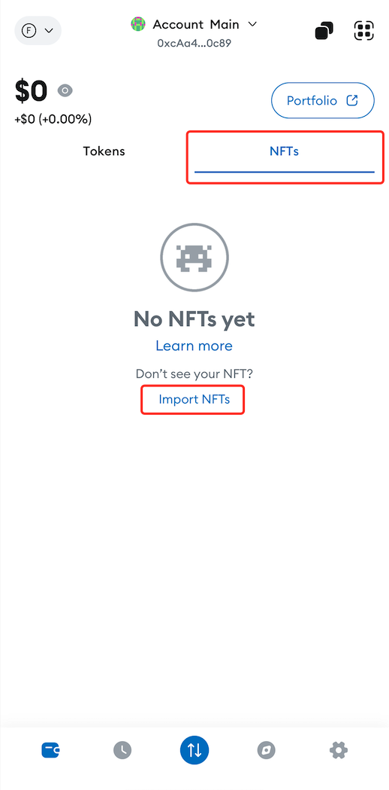
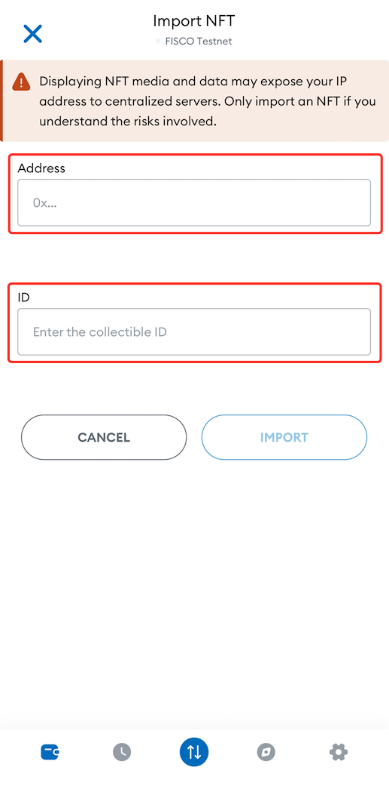
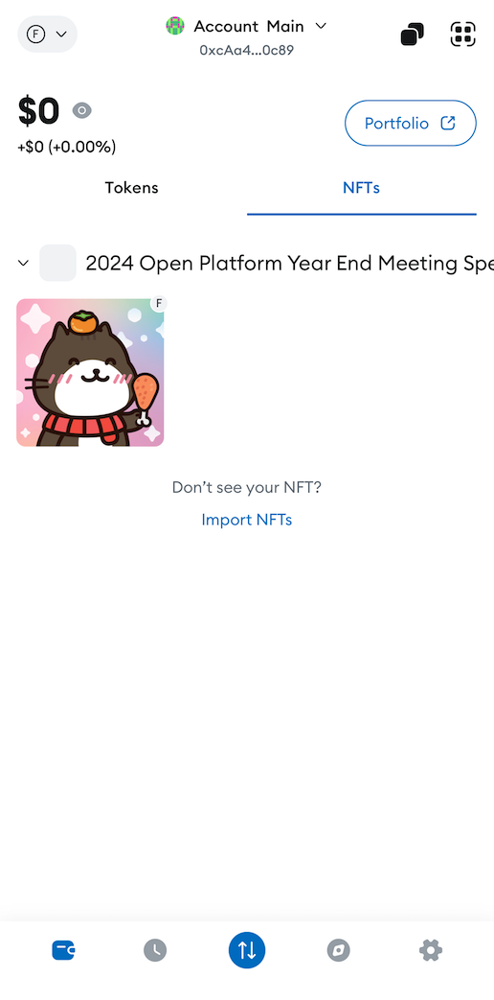

# Guide to import an NFT in your personal Web3 wallet

## How to manually import an NFT in your personal Web3 wallet?

To import your NFT in your crypto wallet, follow the steps below. Please note that you will need to [connect your wallet to our POTOS Network](https://docs.potos.hk/en/latest/dev_guide/connect_guide.html) to view your NFT in your wallet.

**Step 1: Find the NFT's address and ID**

On the NFT's page under Details, there is a purple hyperlinked value labelled 'Contract Address'. If you click 'copy' icon, you'll have it on your clipboard. Also find the NFT's ID's value labelled 'Token ID'.

**Step 2: Open wallet and import NFTs**

In MetaMask Mobile, for example, click on the 'NFTs' tab, scroll down and select the 'Import NFTs' link.

**Step 3: Input NFT's address and ID**

Paste the NFT's address from your clipboard into the 'Address' box and input NFT's ID into 'ID'.

**Step 4: Connect to Our POTOS Network**

To view your NFT in your wallet, you need to [connect your wallet to our POTOS Network](https://docs.potos.hk/en/latest/dev_guide/connect_guide.html). If you're unsure how to do this, refer to our help center for detailed instructions or contact our support team.

