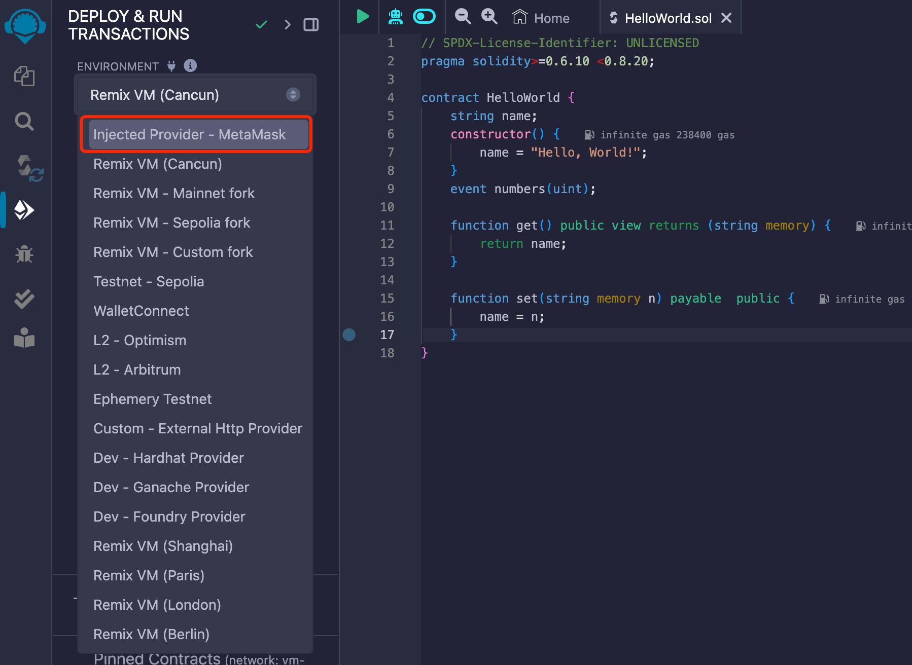

# Guide to Eightart Testnet

## Apply for Testnet "Balance"

### 1. Create A Wallet
If you do not have a wallet yet, create an account using MetaMask (choose any Ethereum-compatible account type) [here](https://metamask.io/download/). 
For more information on MetaMask, please refer [here](https://docs.metamask.io/). 

### 2. Connect MetaMask to Eightart Testnet

To access the Testnet, follow steps below to configure MetaMask:

1. Open the "Network" setting, click "Add a network":

2. Click "Add a network manually":

3. Fill in required information(name, url, chain ID, and currency symbol) for the Testnet and click "Save": 

| Name            	| Eightart Testnet                	 |
|-----------------	|-----------------------------------|
| Network name    	| hkchain_testnet                 	 |
| New RPC URL     	| https://rpc-testnet.eightart.hk 	 |
| Chain ID        	| 20200                        	    |
| Currency symbol 	| FBC                             	 |

4. You will see the Testnet network added to the list.

### 3. Receive Testnet Tokens
Supply your wallet address [here](faucet_site.com) to get free testnet faucet funds. 
Testnet tokens will be issued to your wallet for testing. 

Testnet tokens are crypto assets created on a parallel test network to the Mainnet. 
Developers use the Testnet to test smart contracts and transactions without risking real-world implications on the Mainnet. 
These Testnet tokens work like Mainnet coins, covering gas fees during testing. 
However, as they are issued in the parallel environment, Testnet tokens have no real-world value on the Mainnet.

You may find your wallet address here:

## Trading with MetaMask Wallet
Once balance is updated, you can start trading on the Testnet.

* To transfer tokens to another wallet address, make sure that you set a gas limit >= 210,000 WEI.

Once transaction is confirmed, detailed information will be displayed: 

## Advanced Topics

### Guide to Remix Online IDE

Find more information on Remix Online IDE [here](https://remix-ide.readthedocs.io/en/latest/).

#### Configure Remix Access to Testnet

Configure environment information in the "Deployment & Run Transactions" tab [here](https://remix.ethereum.org/). 
Select "Injected Provider - MetaMask" for "Environment". 

