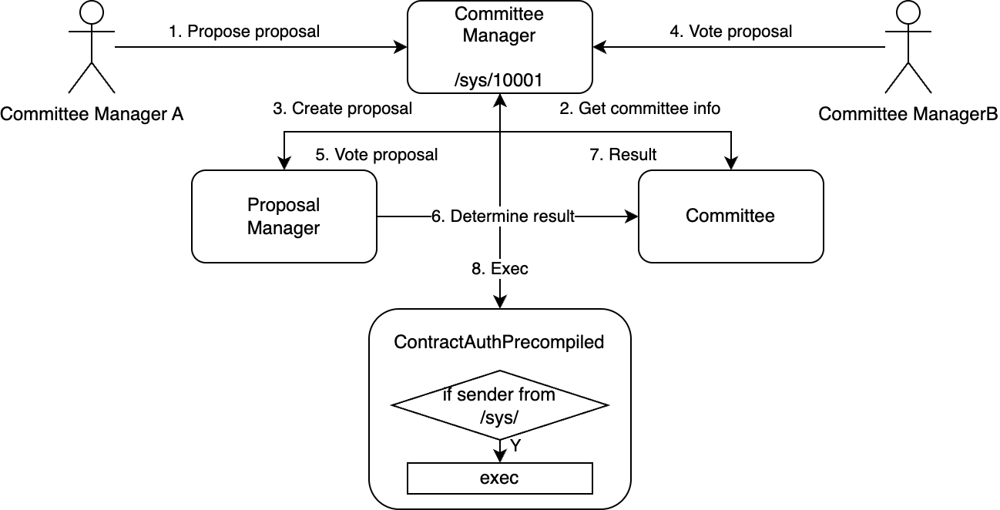
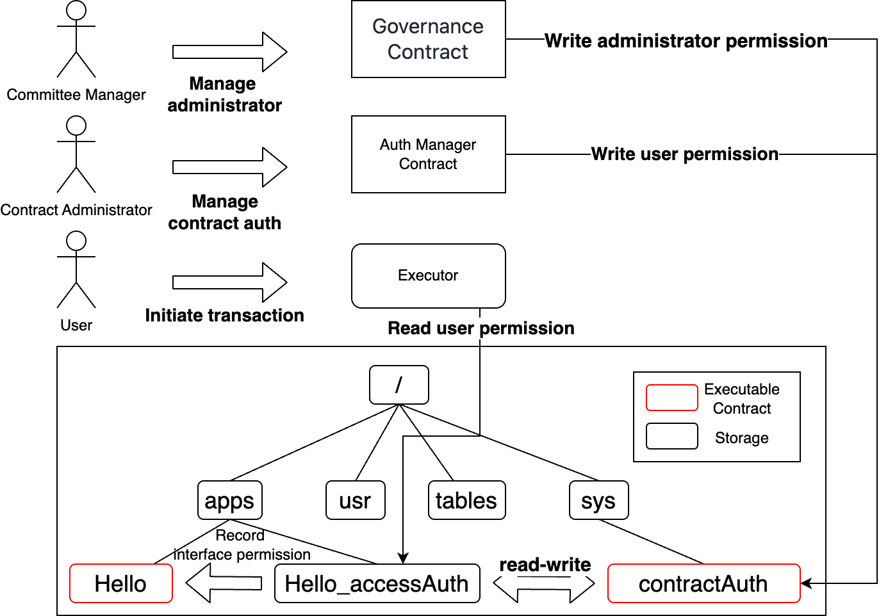
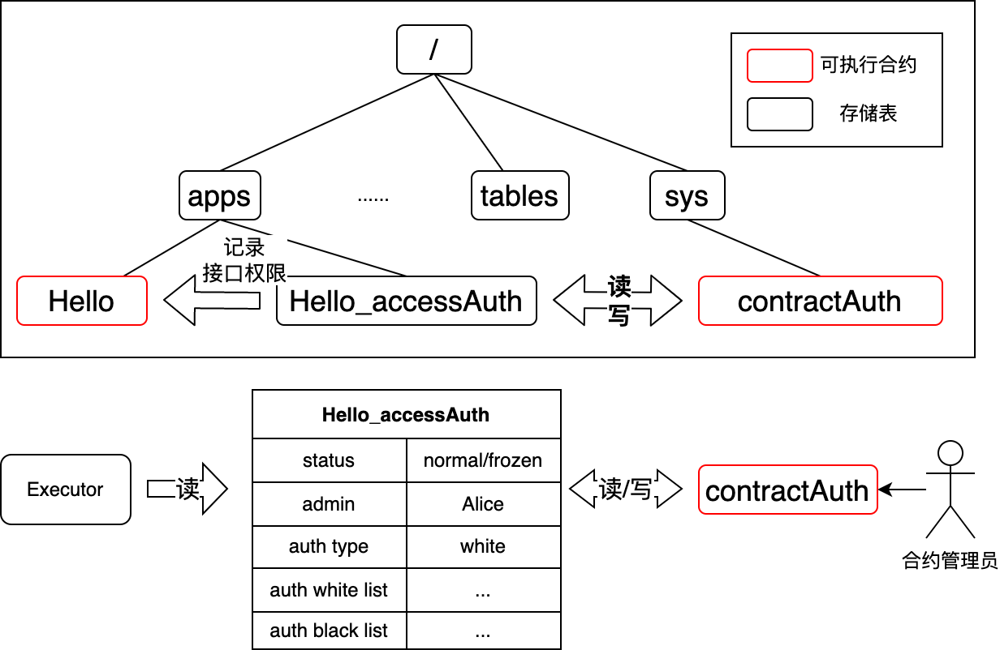
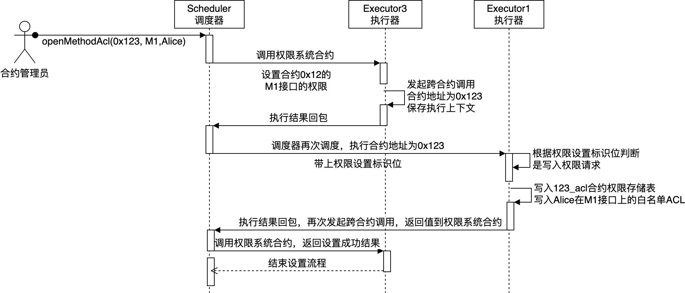
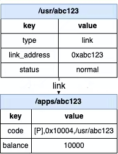

# Governance

## Overview

The on-chain governance system includes a governance committee and permission management.

The governance committee is controlled by a Solidity smart contract, which is pre-deployed and executed as a transaction in Block 0 when the node starts, with a fixed address of `0x10001`, and the final status is written into storage. The main functions of the governance committee include:

- Committee member management
- Committee voting calculation management
- On-chain system parameter and consensus node configuration governance
- Deployment permission governance
- Contract administrator management

Permission management is built into the chain in the form of `precompiled` contracts, and all state changes are the result of calculations by the precompiled contract execution engine. It mainly includes the following contracts:

- AuthManager
  - Replace contract administrators (can only be called by the governance committee contract)
  - Contract interface ACL management
  - Contract status management
  - Write deployment permission ACL (can only be called by the governance committee contract)
- AccountManager
  - EOA account status management (can only be called by governance committee accounts)
- BalanceManager
  - Management of EOA and contract account balances

The related settings of the governance system are in the `config.genesis` genesis block file, as shown in the following example. `is_auth_check` indicates whether the blockchain performs permission control, with a default value of 'false'; `auth_admin_account` is the account address of the first governance committee member at the time of initialization.

In the chain construction script, you can specify this account address; if not specified, an account will be generated automatically and stored locally. **Note:** Please properly save the public and private key pair of the first governance committee member.

```ini
[executor]
    is_auth_check=true
    auth_admin_account=0x976fe0c250181c7ef68a17d3bc34916978da103a
```

## Governance System Design

### Role Division

On-chain roles can be divided into three categories based on different responsibilities: `governance roles`, `contract administrator roles`, and `user roles`, with the three roles managing and being managed in turn.

**Governance Roles**: Govern the on-chain governance rules and the governance committee, belonging to the top-level managers of the chain. At the same time, governance roles can control the `contract administrator roles`.

**Contract Administrator Roles**: The contract administrator role manages the access permissions of single contract interfaces. One contract has only one administrator.

The default contract administrator for a specific contract is the EOA account address of the contract deployer, which is `tx.origin`.

It should be noted that the governance committee can reset the contract contract administrator through a governance committee vote.

**User Roles**: The user role is the role that participates in the business, and any account (including governance roles and contract administrator roles) belongs to the user role.

Whether the user role can participate in related business (send transactions) depends on whether the contract administrator has set relevant permissions. If the contract administrator has not set permission types for the contract interface (blacklist or whitelist mode), then anyone can call the contract interface. If a whitelist is set, access is only allowed when it hits the whitelist; if it is a blacklist mode, access to the corresponding interface is not allowed if it hits.

Based on the above role division, the basic governance rules are as follows:

- Governance roles complete the election of the governance committee and set governance rules through the governance module, such as the voting weight of each governance committee member, the voting rate and participation rate in the governance decision-making process. At the same time, set contract deployment permissions;
- Contract administrator roles deploy business contracts and set permissions for related interfaces of business contracts;
- User roles complete business operations by calling contract interfaces.

### Governance Committee Design

The governance committee includes committee member management, committee voting decision management, and proposal management.

#### Member Management

Committee members all have weights, which will be reflected in the calculation of proposal voting thresholds.

```solidity
// governors address list
LibAddressSet.AddressSet private _governorSet;
// weight mapping table
mapping(address => uint32) private _weightMapping;
// participation threshold, in percentage
uint8 public _participatesRate;
// proposal passing threshold, in percentage
uint8 public _winRate;
```

#### Voting Decision Management

Decision-making rules are based on three dimensions of data: governance voting weight, voting rate, and participation rate. When there is only one governance committee member, **it degenerates into administrator mode**, and all proposals will be passed. If there are multiple governance committee members, the following rules will be used for judgment.

- **When there is a change in the governance member, all undecided proposals will be decided according to the new governance member parameters.**
- Each type of proposal can only be proposed once. If a proposal of the same type has not yet been voted on, it is not allowed to propose the same type of proposal again.
- Each committee member can only vote once on each proposal, and can vote in agree or disagree.

**(1) Participation Threshold**

The participation rate threshold has a value range of 1-100. When the participation rate threshold is set to 0, the participation rate threshold rule is invalid. When the participation rate threshold is adjusted, all undecided proposals will be decided according to the new participation rate threshold. The participation rate threshold decision can be calculated using the following formula. If the formula is not satisfied, it means the proposal's status is `noEnoughVotes`.

**(Total voting weight) / (Total weight) >= (Participation threshold)**

**(2) Passing Threshold**

For the weight passing rate threshold, the value range is 0-100. When the weight passing rate threshold is set to 0, the weight passing rate threshold rule is invalid. When the weight passing rate threshold is adjusted, all undecided proposals will be decided according to the new weight passing rate threshold. The weight passing rate threshold decision can be calculated using the following formula. If it is established, it means the proposal has passed; if not, it means the proposal has failed.

**(Total agreed weight votes) / (Total voting weight) >= (Weight passing rate threshold)**

**(3) Calculation Rule Change**

The calculation rule is determined by a logic contract, which can be replaced. Governance committee members can initiate a proposal vote to change the "calculation rule", and other governance committee members can verify whether the new calculation rule is valid.

**(4) Proposal Validity Period**

Each proposal will have a block number interval when initiated. If the proposal has not been voted on after the block number interval, it will expire. The block number interval defaults to 7\*24\*3600.

#### Proposal Management

Each time the committee proposes a proposal, there will be a unique auto-incrementing proposal id as the identifier, and the specific information of the proposal can be obtained through the id.

```solidity
// Committee handler
VoteComputerTemplate public _voteComputer;
// Auto-generated proposal id
uint256 public _proposalCount;
// (id, proposal)
mapping(uint256 => ProposalInfo) public _proposals;
// (type, (resource id, proposal id))
mapping(uint8 => mapping(address => uint256)) public _proposalIndex;
```

Proposals currently support the following types:

- Governance committee governance
  - 11 - Set committee weight, if this member not exist in committee then add this new member, if weight is set to 0 then remove
  - 12 - Set voting decision participation threshold, passing threshold
  - 13 - Change calculation rule contract
- Deployment permission governance
  - 21 - Set deployment permission type, whitelist/blacklist
  - 22 - Change the deployment permission of a certain EOA
- Contract administrator governance
  - 31 - Change the contract administrator of a certain contract
- System configuration governance
  - 41 - Set a certain system configuration
- Consensus node governance
  - 51 - Set the weight of a certain node, if the weight greater than 0 and this node does not exist in consensus node list then add this new node, if weight is set to 0 then change the consensus node to an observer node
  - 52 - Remove a node from the consensus network

### Governance Committee Execution Steps

The permission governance contract address can refer to: https://github.com/WeTechHK/bcos-auth

The main contracts include:

- **CommitteeManager**: The only entry for permission governance, manages proposals and the governance committee, and governance committee members can call the contract's corresponding interface to initiate governance proposals. It has a unique address `0x10001` in the underlying node.
- **ProposalManager**: Proposal management contract, managed by `CommitteeManager`, used to store proposals.
- **Committee**: Governance committee contract, managed by `CommitteeManager`, records governance committee information.
- **ContractAuthPrecompiled**: Permission information read and write interface provided by the underlying node, write interface has permission control, has a unique address `0x1005` in the underlying node.

The steps for permission governance execution are as follows:

1. `Governance committee member A` initiates a proposal to modify the system configuration and calls the`CommitteeManager` interface.
2. `CommitteeManager` obtains the relevant information of the governance committee member from the existing `Committee`.
3. `CommitteeManager` calls `ProposalManager` to create a proposal and push it into the proposal list.
4. `Governance committee member B` calls the `Committee
   Manager` interface to vote on the proposal.
5. `CommitteeManager` calls `ProposalManager` to vote on the proposal and write it into the voting list.
6. `ProposalManager` collects the voting results of the proposal and calls the `Committee` interface to confirm whether the proposal threshold is reached.
7. `Committee` returns the confirmation result.
8. `CommitteeManager` confirms the status of the proposal, and after reaching an executable state, initiates a call to `SystemConfigPrecompiled` or `ConsensusPrecompiled`.
9. The system precompiled contract will first confirm whether the caller's address starts with /sys/, and if confirmed, execute. (CommitteeManager is a contract built into the chain and has a fixed address /sys/10001)



## Permission Management Design

On-chain permissions are divided into three major parts: on-chain system configuration permission control, contract permission control, and account permission control.

- On-chain system configuration permission control includes the management permission control of all on-chain system parameters and the management permission control of all nodes in the blockchain network.
- Contract permission control is mainly for the lifecycle permission control of contracts.
- Account permission control includes the lifecycle permission control of accounts and the permission control of account balances.

It is worth noting that all on-chain permission controls are controlled by a total switch of the on-chain system configuration `auth_check_status`. When this configuration is 0, all precompiled contract permissions are not effective during execution, but the specific permissions are still stored on the chain; when it is a non-zero value, all permissions are effective.

### Permission Control Overview Table

Governance Committee Permission Operations

| Operation Name                                          | Permission Control Role     | Requires Voting |
|---------------------------------------------------------|-----------------------------|-----------------|
| Change governance committee voting threshold            | Governance committee member | Yes             |
| Add/Change/Remove a certain governance committee member | Governance committee member | Yes             |
| Change calculation template contract                    | Governance committee member | Yes             |
| Change the administrator of a certain contract          | Governance committee member | Yes             |

System Configuration Permission Operations

| Operation Name                                           | Permission Control Role     | Requires Voting |
|----------------------------------------------------------|-----------------------------|-----------------|
| Set on-chain system configuration                        | Governance committee member | Yes             |
| Change consensus node, observer node, node voting weight | Governance committee member | Yes             |
| Change rPBFT node election rights                        | Governance committee member | **No**          |
| Sharding configuration                                   | Governance committee member | **No**          |

Contract Permission Control Operations

| Operation Name                                          | Permission Control Role     | Requires Voting |
|---------------------------------------------------------|-----------------------------|-----------------|
| Contract deployment permission setting                  | Governance committee member | Yes             |
| Contract interface ACL                                  | Contract administrator      | No              |
| Contract status change (freeze, unfreeze, decommission) | Contract administrator      | No              |

Account Permission Control Operations

| Operation Name                                         | Permission Control Role                                                 | Requires Voting |
|--------------------------------------------------------|-------------------------------------------------------------------------|-----------------|
| Account status change (freeze, unfreeze, decommission) | Governance committee member                                             | **No**          |
| Account balance operation                              | Balance manager caller, initialized as all governance committee members | **No**          |
| Register/Remove balance manager caller                 | Governance committee member                                             | **No**          |

### On-Chain System Configuration Permission Control

As can be seen from Section 2, the permission control of on-chain system configuration mainly includes the permission control of two important precompiled contracts:

- <0x1000, SystemConfigPrecompiled> This precompiled contract controls the writing of all on-chain system parameters.
- <0x1003, ConsensusPrecompiled> This precompiled contract controls the identity and consensus weight of all nodes on the chain.

From Section 2, it is known that all on-chain system configurations can be changed through governance committee voting proposals. When the permission master switch `auth_check_status` is in the on state, the write interfaces of these two contracts will restrict calls to only `msg.sender` being the governance committee contract address `0x10001`.

**Except for one new interface:** `setTermWeight(string,uint256)`, this interface can be called as long as the caller is a member of the committee.

### Contract Permission Control

As shown above, permission control is organized into three levels: governance committee members can control every contract administrator by proposing vote-proposals; contract administrator can control ACL of one single contract's interfaces.



#### Contract Deployment Permission Control

From Section 2, it is known that the permission control of contract deployment can only be changed by the governance committee contract, and members need to initiate proposals and pass votes to change.

After the governance committee votes and passes, it will call the interface of the precompiled contract <0x1005, AuthManagerPrecompiled>, written in the storage table in the following form:

| name | type      | status | acl_type    | acl_black       | acl_white     |
|------|-----------|--------|-------------|-----------------|---------------|
| apps | directory | normal | black/white | {"alice": true} | {"bob": true} |

During execution, it will verify whether the EOA account address of `tx.origin` has verification permissions.

After the contract deployment transaction is executed, the default administrator of the contract is the EOA account address of the contract deployer, i.e., `tx.origin`. If a contract interface is called to deploy a contract, then the default contract administrator for that deployed contract is the tx.origin EOA account address.

When the contract deployment creates the contract storage table, it will include the creation of a contract permission control appendix, as shown below. The contract administrator will change the contract interface permissions by changing this permission control appendix.



#### Contract Interface Permission Control

The contract administrator can fully control the permissions of the contract interface.



When a normal user accesses a contract interface, the contract permission control table will be checked for any permission restrictions on ordinary users.


#### Contract Freezing, Thawing, and Decommissioning

Similarly, the contract administrator can fully control the status of the contract. It is worth noting that once a contract is in a decommissioned state, there is no chance to modify or normally call it.

### Account Permission Control

The data structure of the account is as follows, and the permissions regarding the account will be recorded in the `/usr/abc123` table, and the balance of the account will be recorded in the corresponding mapping table `/apps/abc123`.



#### Account Lifecycle

Account status settings (freezing, thawing, decommissioning) can be changed by any committee member.

#### Account Balance Permission Control

`balancePrecompiled` maintains a separate caller list: `s_balance_caller`, which records all usable account addresses.

This list will obtain all `governance committee member` addresses during initialization and write them into the list.

The addition and reduction of this list are only allowed to be operated by committee members, without the need for voting.
