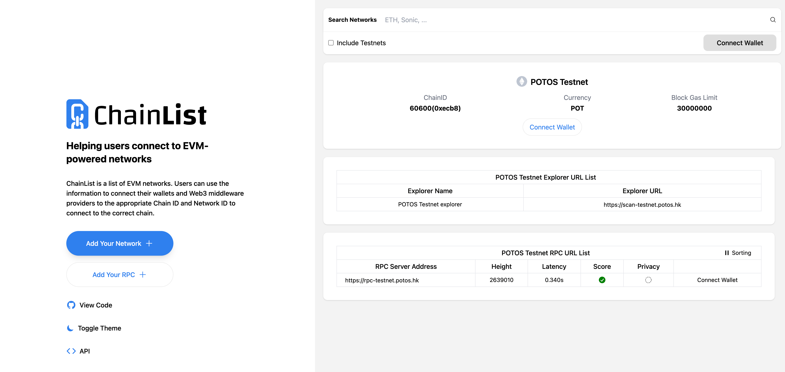
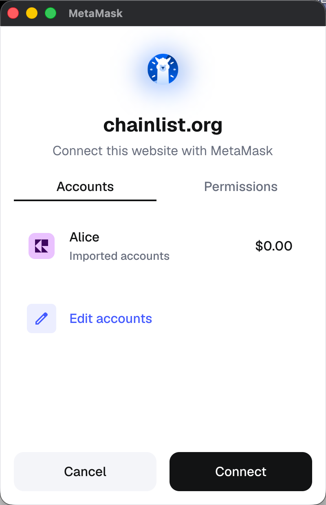
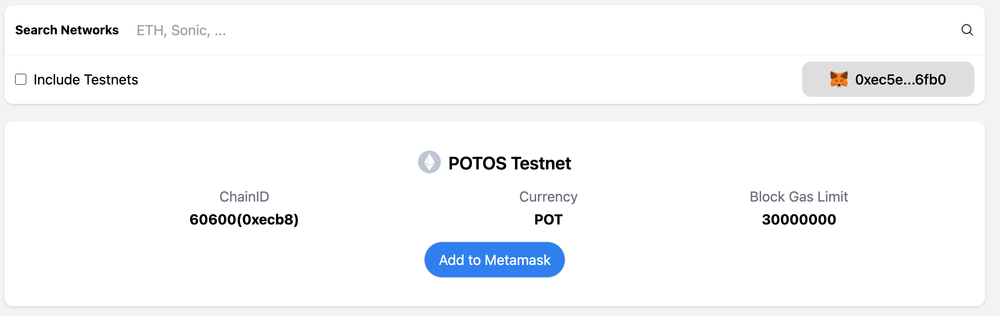

# Set up Account and Connect Network

This guide will walk you through the process of setting up MetaMask and connecting to the POTOS Testnet.
This is a necessary step for developers who want to deploy and interact with Dapps or smart contracts on our network.

This guide consists of four clear steps:

- Install MetaMask
- Create a MetaMask account
- Connect to the Testnet
- Get Testnet tokens

## Step 1: Install MetaMask

1. Google "MetaMask" or visit the [MetaMask download page](https://metamask.io/download/) and click "Install MetaMask for Chrome". Alternatively, you can get the mobile app for iOS or Android.  ![[image]](../_static/dev_guide/download_metamask.png)
   ![[image]](../_static/dev_guide/download_metamask_mobile.png)
2. Click **"Add to Chrome"**. ![[image]](../_static/dev_guide/add_to_chrome.png)
3. A popup will appear. Click **"Add Extension"** to confirm.
4. Once installed, the MetaMask fox icon will appear in your browser toolbar. ![[image]](../_static/dev_guide/metamask_toolbar.png)

## Step 2: Create a MetaMask Account

1. For Chrome extension, click on the MetaMask fox icon in the toolbar to open the extension. For mobile app, open the app and follow instructions.
2. Check **Terms of use** agreement and click on **"Create a new wallet"**. ![[image]](../_static/dev_guide/create_wallet.png)
3. Agree or disagree to the MetaMask data collection option (this is optional and won't affect functionality).
4. Set a strong password for your wallet and click on **"Create a new wallet"**. ![[image]](../_static/dev_guide/set_password.png)
5. MetaMask will give an option to set up secret recovery phrase:
   - **"Remind me later"** will skip this step.
   - **"Secure my wallet"** will take you to the next step.
6. MetaMask will display a group of 12 words as **Secret Recovery Phrase**:
   - Write down the phrase in order and keep it safe.
   - Never share this phrase with anyone. ![[image]](../_static/dev_guide/secret_recovery_phrase.png)
7. Confirm your Secret Recovery Phrase by filling the missing words in the correct order. ![[image]](../_static/dev_guide/confirm_phrase.png)
8. Click **"Done"** to complete the account creation. ![[image]](../_static/dev_guide/done.png)

## Step 3: Connect to the Testnet via Chainlist

1. Visit https://chainlist.org/chain/60600 
2. Click on **"Connect Wallet"** and select your wallet. 
3. Click on **"Add MetaMask"** and approve the request in the wallet popup. 
4. Click on **"Save"** to complete the network addition.

## Optional: Connect to the Testnet manually

If you want to connect to the Testnet manually, you can follow the steps below:

1. Open MetaMask on Chrome extension or mobile app and unlock it using your password.
2. Click on the **Network Selector** (top-left dropdown that shows "Ethereum Mainnet" by default). ![[image]](../_static/dev_guide/select_network.png)
3. Select **"+ Add a custom network"**. ![[image]](../_static/dev_guide/add_new_network.png)
4. Fill in the details for our Testnet and Click **“Save”**:

   | Entry Name         | Value                          | Note                         |
   |--------------------|--------------------------------|------------------------------|
   | Network name       | POTOS Testnet                  | Name of network              |
   | Default RPC URL    | https://rpc-testnet.potos.hk/  | RPC URL of network           |
   | Chain ID           | 60600                          | blockchain's chain ID        |
   | Currency symbol    | POT                            | token symbol                 |
   | Block explorer URL | https://scan-testnet.potos.hk/ | URL of blockchain's explorer |

   ![[image]](../_static/dev_guide/network_detail.png)
