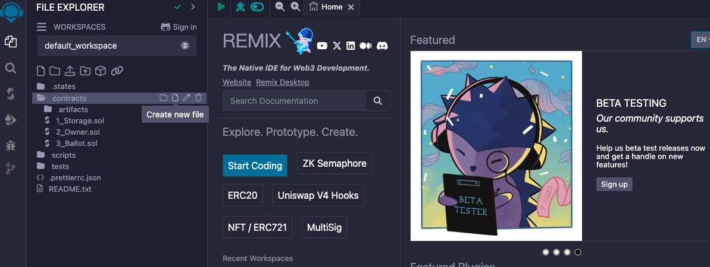
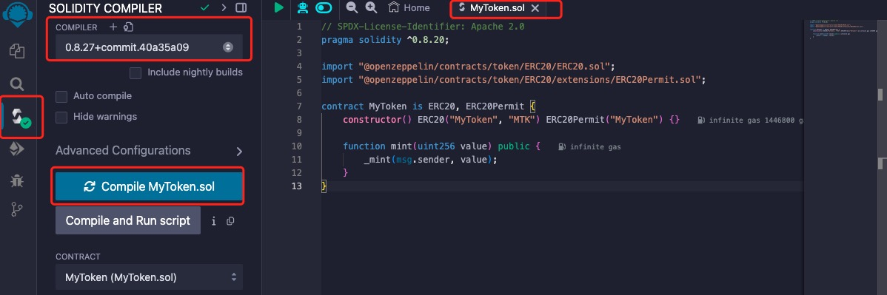
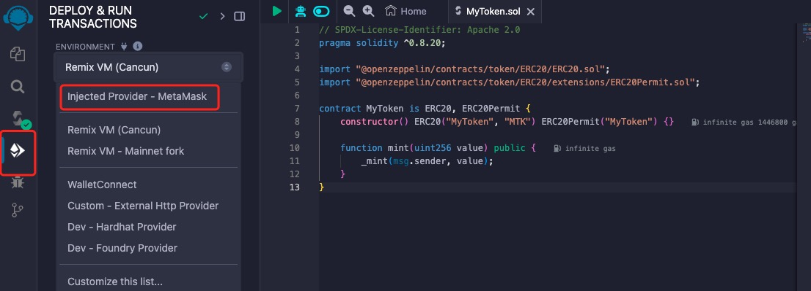
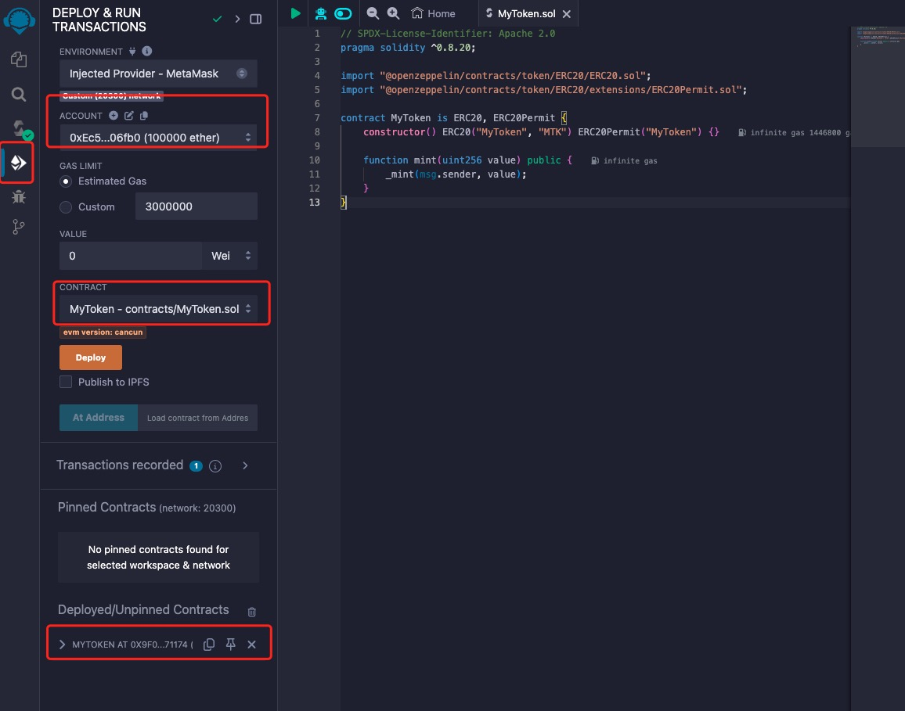
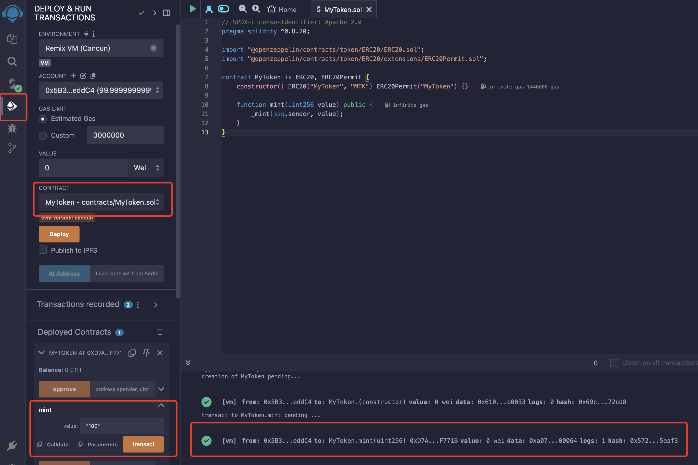

# Deploy Smart Contract with Remix

Remix is a browser-based IDE (Integrated Development Environment) for developing Solidity contracts. In this guide, you will learn how to:

* Create and upload a pre-built smart contract in Remix IDE.
* Compile the smart contract.
* Set up the deployment environment.
* Import an account.
* Connect POTOS to Remix using MetaMask
* Deploy the smart contract.
* Verify the smart contract.

This section will cover how to connect Remix with POTOS. If you want to know more about Remix, please refer to [Remix docs](https://remix-ide.readthedocs.io/en/latest/) or [Remix IDE](https://remix.ethereum.org/).

## Create a file on Remix

To start building a smart contract, click on **New File** icon in the **contracts** folder in the **File explorer** tab and name it `MyToken.sol`



Then copy and paste the smart contract code provided below into the newly created `MyToken.sol` file.

```solidity
// SPDX-License-Identifier: Apache 2.0
pragma solidity ^0.8.20;

import "@openzeppelin/contracts/token/ERC20/ERC20.sol";
import "@openzeppelin/contracts/token/ERC20/extensions/ERC20Permit.sol";

contract MyToken is ERC20, ERC20Permit {
    constructor() ERC20("MyToken", "MTK") ERC20Permit("MyToken") {}

    function mint(uint256 value) public {
        _mint(msg.sender, value);
    }
}
```

## Compile the smart contract

To compile your contract, do the following:

* Go to the **Solidity Compiler** tab.
* Select compiler version to 0.8.27.
* Turn on the ``Auto compile'' option.
* Click on the **Compile MyToken.sol** button to compile `MyToken.sol` contract.
* If compile successfully, it will show a green tick mark on the **Compiler** tab button.



## Set up the deployment environment

Open the **Depoly and run transactions** tab and select **Environment** to *Injected Provider - MetaMask*



## Import an account in Metamask

You first need to use Metamask to create a new account or import exist account. [More about account in Metamask](./connect_network.md)

* When you see the MetaMask pop-up, select your account.
* Once you are successfully connected to the Network, you will see the the corresponding Chain ID and Account of the connected network.

## Deploy the smart contract

On the premise that `MyToken.sol` has been compiled, follow the deployment process below:

* Go to the **Deploy & run transactions** tab.
* Make sure **ENVIRONMENT** is `Injected Provider - Metamask`.
* Select the contract you want to deploy in the **CONTRACT** field.
* Click on the **Deploy** button. This would generate a Metamask popup that requires transaction confirmation. Simply confirm the transaction!



## Interact with the smart contract

After deploying, you can interact with the contract by calling the `mint` function by following the below stpes. This function will mint tokens to the account of transaction sender.

* Go to the **Deploy & run transactions** tab
* Select the deployed contract.
* Click on the **mint** function.
* Enter the amount of tokens you want to mint.
* Click on the **transact** button.
* Confirm the transaction in Metamask.
* You can click on the "Terminal" tab below the page to see the transaction details.


