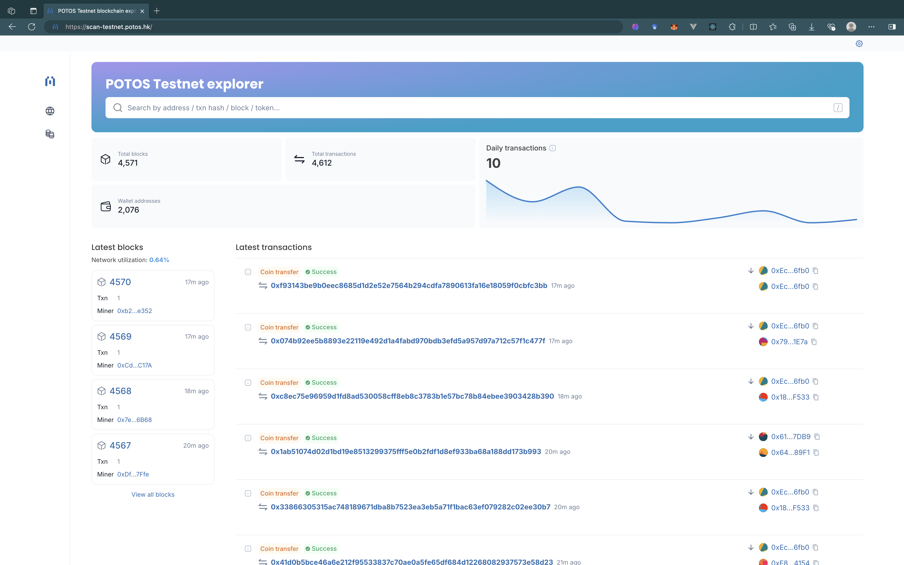
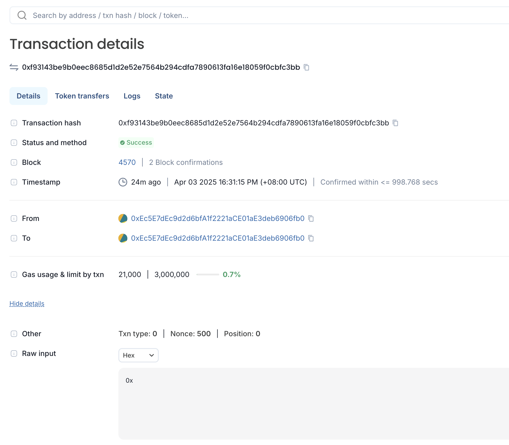
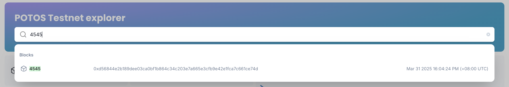

# Explorer

Explorer gives you an insight about the blockchain network by monitoring the network health and providing various statistics. You can also explore the block and transaction data and the list of smart contracts on the POTOS blockchain network. POTOS blockchain Explorer has the following major features:

* Overview of the blockchain network
* Blockchain search
* Blocks and transactions information
* Account information

This guide will demonstrate how to use BlockScout to explore our Testnet.

## Accessing Testnet Explorer

You can access the Testnet Explorer at the following URL: https://scan-testnet.potos.hk

You will see the BlockScout homepage, with statistics on live blocks, transactions, and addresses.

## Dashboard

Network information is presented in the dashboard. The information includes the transaction amount, the height of last block committed, and the latest trends in transactions.

* Total Blocks: The number of total blocks that have been generated.
* Total Transactions: The number of total transactions that have been committed.
* Wallet Addresses: The number of total EOA addresses that have interacted with the network.
* Last Blocks: The list of the last some blocks that have been generated. You can click on the block height to get the detail view of the block.
* Last Transactions: The list of the last some transactions that have been committed. You can click on the transaction hash to get the detail view of the transaction.

## Block detail

Click on a block height to get overall information about the block:

## Transaction detail

Click on a transaction hash to get overall information about the transaction:

* From -&gt; To: The addresses of sender and receiver. By clicking the address, you can go to the detail view of the account. If a file icon appears next to an address, it indicates that the address belongs to a smart contract.
* Timestamp: Elapsed time since the transaction was executed.

## Search

Through POTOS Explore, you can search for the information about transactions, blocks, address or token. Entering a valid keyword will take you to the detail view of the entity.

