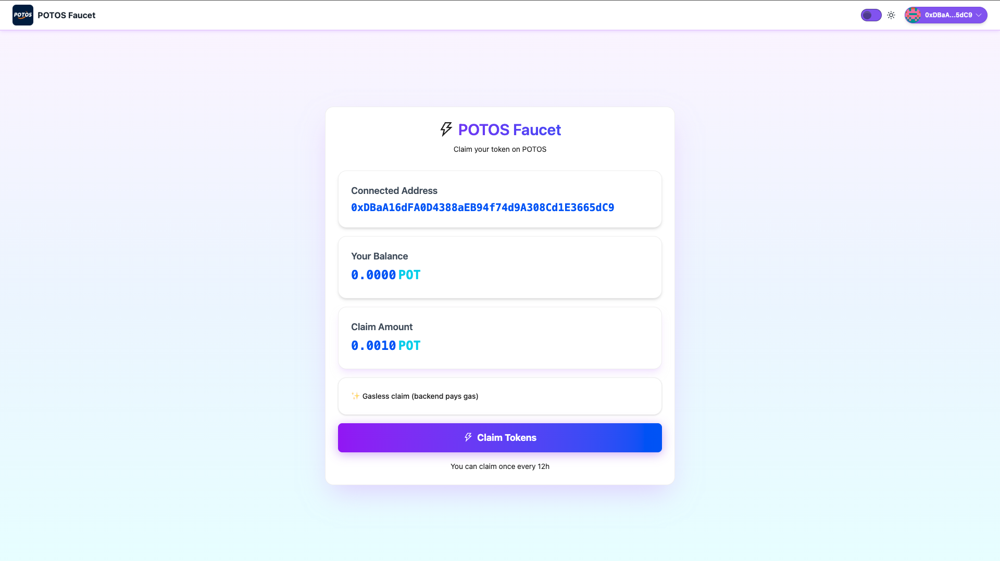
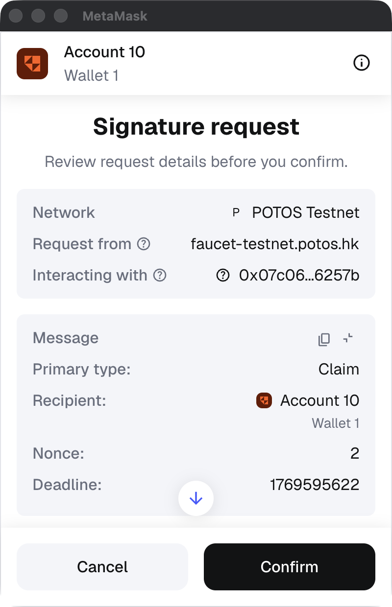
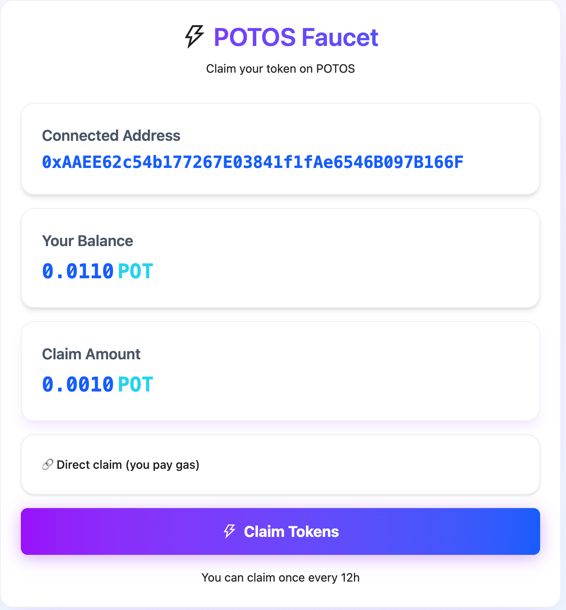
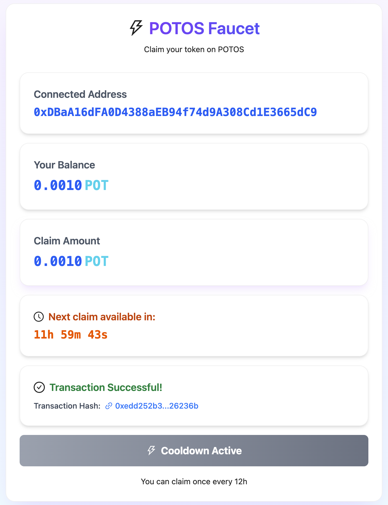

# Get POT(Gas Token) from Faucet

The POTOS Faucet is a tool for obtaining test tokens on the POTOS testnet. This guide will help you understand how to use the faucet to claim test tokens.

## Overview

The POTOS Faucet allows users to periodically claim test tokens (POT) on the testnet for developing and testing DApps or smart contracts. You can claim **0.0010 POT** per transaction, with a **12-hour** cooldown period between claims.

Access the faucet at: [https://faucet-testnet.potos.hk/](https://faucet-testnet.potos.hk/)

## Prerequisites

Before using the faucet, you need to:

1. **Have MetaMask installed and set up**
   - If you haven't installed MetaMask yet, refer to Steps 1 and 2 in the [Connect Network Guide](./connect_network.md).

2. **Be connected to the POTOS Testnet**
   - Ensure your MetaMask is connected to the POTOS Testnet (Chain ID: 60600)
   - If not connected, refer to Step 3 in the [Connect Network Guide](./connect_network.md).

## Usage Steps

### Step 1: Access the Faucet Page

1. Open the [POTOS Faucet page](https://faucet-testnet.potos.hk/) in your browser
2. The page will display the faucet interface, including:
   - The "POTOS Faucet" title and wallet connection status at the top
   - A central white card containing all faucet information

### Step 2: Connect Your Wallet

1. If your wallet is not yet connected, click the wallet connect button in the top-right corner
2. Confirm the connection request in the MetaMask popup window
3. Once connected, your wallet address will be displayed in the top-right corner (e.g., `0x2b4C...E8CC`)

### Step 3: View Account Information

After connecting your wallet, the faucet card will display the following information:

- **Connected Address**: Your currently connected wallet address
- **Your Balance**: Your current POT token balance in the wallet
- **Claim Amount**: The fixed amount of tokens you can claim per transaction (0.0010 POT)

### Step 4: Claim Tokens

#### Scenario A: First-Time User Without POT Tokens

If you are using the faucet for the first time and your wallet has no POT tokens:

1. Click the **"Claim"** button
2. Confirm the transaction in MetaMask
3. **Note**: For users without POT tokens, the first claim will be processed by the backend service for on-chain operations, so you don't need to pay gas fees
4. Wait for transaction confirmation
5. Upon successful transaction, you will see a "Transaction Successful!" message

#### Scenario B: User With Existing POT Tokens

If your wallet already contains POT tokens:

1. Check if you are in the cooldown period:
   - If "Cooldown Active" is displayed, the button will be disabled
   - Check the "Next claim available in" countdown timer
2. If not in cooldown:
   - Click the **"Claim"** button
   - Confirm the transaction in MetaMask and pay the gas fee
   - Wait for transaction confirmation
   - Upon successful transaction, you will see a success message and transaction hash

### Step 5: View Transaction Details

After a successful transaction:

1. In the "Transaction Successful!" section, you will see the transaction hash (e.g., `0x3a1453aa...e28edd`)
2. Click the link icon next to the transaction hash to view complete transaction details on the blockchain explorer
3. You can also view transaction history in MetaMask

## Important Notes

### Cooldown Mechanism

- **Cooldown Period**: After each claim, you must wait **12 hours** before claiming again
- **Cooldown Display**: The page displays a countdown timer showing when the next claim will be available
- **During Cooldown**: The claim button will display "Cooldown Active" and be disabled

### Claim Limits

- **Claim Amount**: Fixed at **0.0010 POT** per transaction
- **Claim Frequency**: Once every 12 hours
- **No Upper Limit**: You can continue claiming test tokens as long as the cooldown requirement is met

### First-Time User Special Handling

- For users **without POT tokens**, when using the faucet for the first time:
  - The backend service will execute the on-chain operation on your behalf
  - You do not need to pay gas fees
  - This allows new users to obtain initial test tokens free of charge

### Gas Fees

- **First-time use (no POT tokens)**: Covered by the backend service, no user payment required
- **Subsequent use (with POT tokens)**: Users must pay gas fees using POT tokens from their wallet

## Frequently Asked Questions

### 1. Why does the button show "Cooldown Active"?

This indicates that less than 12 hours have passed since your last claim. Please wait for the countdown to complete before attempting to claim again.

### 2. How can I view my transaction?

- Click the link icon next to the transaction hash to view it on the blockchain explorer
- Or check your transaction history in MetaMask

### 3. What should I do if the claim fails?

- Verify that your wallet is connected to the POTOS Testnet
- Ensure you have sufficient POT tokens in your wallet to pay gas fees (except for first-time use)
- Check your network connection
- If the problem persists, try again later

### 4. How many times can I claim?

You can claim test tokens unlimited times as long as you meet the 12-hour cooldown requirement.

## Next Steps

After obtaining test tokens, you can:

- Deploy smart contracts to the testnet
- Interact with DApps on the testnet
- Test your application functionality
- Refer to other development guides for more features

---

**Note**: Test tokens are for development and testing purposes only and have no real-world value. Please keep your wallet private keys and seed phrases secure.
