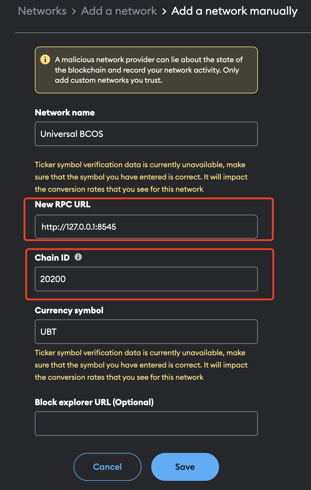

# Run an observer node

This section provides a step-by-step guide to running an observer node on your own environment.

Here are three ways to run an observer node, choose the one that best suits your needs:

1. [Run a observer node manually](#run-a-observer-node-manually)
2. [Run observer node in Docker](#optional-run-observer-node-in-docker)

## System requirements

Running an observer node requires the following system requirements:

| Specifications | Recommended            | Lowest               |
|----------------|------------------------|----------------------|
| CPU            | 16 cores               | 4 cores              |
| Memory         | 64 GB                  | 8 GB                 |
| Storage        | > 4 TB SSD, 4,000 Mbps | > 1 TB SSD, 800 Mbps |
| Network        | 10 Gbps                | 10 Mbps              |

### Storage Expansion Requirements

To address storage expansion, the requirement is determined by both the block size and transaction volume. Assuming average transaction size of 200 bytes and with each block containing approximately 100 transactions, the storage needed per block stands at 20 KB. With a block interval set at 1 second, this translates to a daily storage requirement of 20 KB multiplied by 24 hours by 3600 seconds, equating to 1.65 GB per day. This calculation underscores the importance of considering both the frequency and size of transactions when planning for storage capacity.

### Operation System

- (Recommended) AWS Amazon Linux2, or other linux-based environments in mainstream cloud services provider.
- (Recommended) Ubuntu 22.04 LTS in x86_64 or arm64.
- CentOS 7/8 in x86_64 ir arm 64.
- macOS 13.0 or later in  x86_64 or arm64.

## Run a observer node manually

### Step 1. Download FISCO BCOS binaries

Download the FISCO BCOS binaries from the [github release](https://github.com/WeTechHK/Universal-BCOS/releases).

### Step 2. Build an empty node directory

Create a directory to store the FISCO BCOS binaries and configuration files, and build an empty node directory.

```bash
mkdir -p ~/path/to/FISCO BCOS
cd ~/path/to/FISCO BCOS

# Copy the downloaded FISCO BCOS binaries to the node directory
cp ~/path/to/downloaded/universal-bcos-linux-x86_64.tar.gz .
tar -xvf universal-bcos-linux-x86_64.tar.gz

# Build an empty node directory
bash build_chain.sh -C expand -o nodes/127.0.0.1/node4 -e ./universal-bcos

tree ./nodes
./nodes
└─── 127.0.0.1
    ├── universal-bcos
    ├── node0
    │   ├── conf
    │   ├── config.ini
    │   ├── start.sh
    │   └── stop.sh
    ├── start_all.sh
    └── stop_all.sh
```

### Step 3. Obtain certificate of connection

To connect to the network, you need to obtain a certificate from the network operator. The certificate is used to authenticate your node and establish a secure connection to the network.

#### For network operator

If you are the network operator, you can generate a certificate using the `FISCO BCOS` command line tool.

```bash
cd ~/path/to/FISCO BCOS
bash build_chain.sh -C expand -c nodes/127.0.0.1/node0 -d nodes/ca -o expand_node
tar -czvf expand_node.tar.gz expand_node
```

This command generates a certificate and saves it to the `certs` directory in the current working directory.

#### For user to connect

If you are a user, you need to obtain a certificate from the network operator. The operator will provide you with a certificate file that you can use to connect to the network.

```bash
cp ~/expand_node.tar.gz ~/path/to/FISCO BCOS
cd ~/path/to/FISCO BCOS
tar -xvf expand_node.tar.gz
cp -r ~/path/to/FISCO BCOS/expand_node/conf ~/path/to/FISCO BCOS/nodes/127.0.0.1/node0/
```

And then, touch `nodes.json` file in the node directory.

```bash
touch ~/path/to/FISCO BCOS/nodes/127.0.0.1/node0/nodes.json

# You can specify the IP address and port of the consensus node in the nodes.json file
echo '{"nodes":["127.0.0.1:30300"]}' > ~/path/to/FISCO BCOS/nodes/127.0.0.1/node0/nodes.json
```

### Step 4. Obtain genesis block

To sync block from main blockchain, you need to obtain the genesis block from the blockchain operator. The genesis block is the first block in the blockchain and contains the initial state of the network.

#### For blockchain operator

Just provide the genesis block file to the user.

```bash
cp ~/path/to/FISCO BCOS/nodes/127.0.0.1/node0/config.genesis ~/path/to/FISCO BCOS
```

#### For user

```bash
cp ~/config.genesis ~/path/to/FISCO BCOS/nodes/127.0.0.1/node0/
```

### Step 5. Everything is ready?

After completing the above steps, you should have the following files in the node directory, please check it twice :)

```bash
cd ~/path/to/FISCO BCOS/nodes/
tree ./nodes
./nodes
└─── 127.0.0.1
    ├── universal-bcos
    ├── node0
    │   ├── conf
    │   │   ├── ca.crt
    │   │   ├── cert.cnf
    │   │   ├── node.nodeid
    │   │   ├── node.pem
    │   │   ├── ssl.crt
    │   │   ├── ssl.key
    │   │   └── ssl.nodeid
    │   ├── config.genesis
    │   ├── config.ini
    │   ├── nodes.json
    │   ├── start.sh
    │   └── stop.sh
    ├── start_all.sh
    └── stop_all.sh
```

### Step 6. Start observer node

Before starting the observer node, you need to ensure that port `30300`, `20200` and `8545` are not occupied by other services. If you want to edit the configuration of the observer node, you can edit the `config.ini` file in the node directory, check more details in the [Configure observer node](#configure-observer-node) section.

Run the `start_all.sh` script to start the observer node.

```bash
cd ~/path/to/observer/observer_node
# Start observer node
bash start_all.sh
# Observer node pid is 98622
 node0 start successfully pid=98622

ps -ef | grep bcos
501 98622     1   0 10:36下午 ttys019   13:33.97 /path/to/observer/observer_node/node0/../universal-bcos -c config.ini -g config.genesis
```

After starting the observer node, it will start to synchronize the block data. You can grep the log file to check the synchronization status.

```bash
tail -f node0/log/* | grep Report

# Many logs will be printed, and the following is an example of the log
info|2024-10-15 22:36:31.415281|[CONSENSUS][PBFT][METRIC]^^^^^^^^Report,sealer=2,txs=1,committedIndex=203,consNum=204
```

### Step 7. Using Console to Interact with Observer Node

The observer node provides a console tool to interact with the observer node. You can use the console tool to query the block information, transaction information, and other information of the observer node.

```bash
cd ~/path/to/observer/observer_node/console
# Start the console tool
bash start.sh
```

After starting the console tool, you can use the console tool to interact with the observer node.

```bash
=============================================================================================
Welcome to FISCO BCOS console(3.7.0)!
Type 'help' or 'h' for help. Type 'quit' or 'q' to quit console.
=============================================================================================
[group0]: /apps> getSyncStatus
SyncStatusInfo{
    isSyncing='false',
    protocolId='null',
    genesisHash='4c111014f67613a8960d94a9076623857718fc560bd9e958e5dbabeb62f30baa',
    nodeId='7a810fc2eb501f8714e096c87bee8fd7afc7b1539dc22ed18ee18b84842fa96e916d4c2a485afb5c371a404cba714c18ffaedf25514914e5e501a5fde77dce82',
    blockNumber='205',
    latestHash='f61568ad595db09e42f6a90afc880c4dad98556dd776783ce428e17d1d755a25',
    knownHighestNumber='205',
    txPoolSize='null',
    peers=[
        PeersInfo{
            nodeId='3e971195fd767fdb47a9057563ff139e89e29b39a223040bc0d535b090d71cbd4e9e6b60ee18bf2d160519f30922b2a97a97537cf334f353fa72b3247cbc034a',
            genesisHash='4c111014f67613a8960d94a9076623857718fc560bd9e958e5dbabeb62f30baa',
            blockNumber='205',
            latestHash='f61568ad595db09e42f6a90afc880c4dad98556dd776783ce428e17d1d755a25'
        }
    ],
    knownLatestHash='f61568ad595db09e42f6a90afc880c4dad98556dd776783ce428e17d1d755a25'
}
```

### Step 8. Connecting MetaMask to Observer Node

After the observer node is started, it will start a JSON-RPC service on port `8545`. You can connect MetaMask to the observer node by adding a custom RPC.

If you do not have a wallet yet, create an account using MetaMask (choose any Ethereum-compatible account type) [here](https://metamask.io/download/). For more information on MetaMask, please refer [here](https://docs.metamask.io/).

To access the observer node network, follow steps below to configure MetaMask:

- Open the “Network” setting, click “Add a network”:

    

- Click “Add a network manually”:

    

- Fill in required information for the local observer node network and click “Save”.
  - The default chain ID for FISCO BCOS is `20200` and the default RPC URL is `http://127.0.0.1:8545`. The `Network name` and `Currency symbol` are not required, you can fill in any name you like.

    

- You will see the observer node network added to the list.

### Step 9. Stop observer node

```bash
cd ~/path/to/FISCO BCOS/nodes/
bash stop_all.sh
```

## (Optional) Run observer node in Docker

Comming soon.

## Configure observer node

You can configure the observer node by editing the `config.ini` file in the node directory. The `config.ini` file contains the configuration settings for the observer node, such as the network settings, logging settings.

For more details about the configuration settings, see the [Configuration of FISCO BCOS](./config.md).

### Network settings

The network settings in the `config.ini` file specify the IP address and port of the observer node. The file location is in `~/path/to/observer/observer_node/node0/config.ini`.

```ini
[p2p] ; p2p network configuration
    listen_ip=0.0.0.0
    listen_port=30300
[rpc] ; FISCO BCOS rpc configuration, used in console
    listen_ip=0.0.0.0
    listen_port=20200
[web3_rpc] ; web3 standard rpc configuration, used in MetaMask
    enable=true
    listen_ip=0.0.0.0
    listen_port=8545
    thread_count=8
```

### Logging settings

The logging settings in the `config.ini` file specify the log level and log file location. The file location is in `~/path/to/FISCO BCOS/nodes/config.ini`.

```ini
[log]
    enable=true
    ; print the log to std::cout or not, default print to the log files
    enable_console_output = false
    log_path=./log
    ; info debug trace
    level=info
    ; MB
    max_log_file_size=1024
    ; rotate the log every hour
    ;enable_rotate_by_hour=true
    enable_rate_collector=false
```

### Node starting and stopping

The `start.sh` and `stop.sh` scripts in the node directory are used to start and stop the observer node. You can run the `start.sh` script to start the observer node and the `stop.sh` script to stop the observer node.

```bash
cd ~/path/to/FISCO BCOS/nodes/
# Start observer node
bash start_all.sh
# Stop observer node
bash stop_all.sh
```
