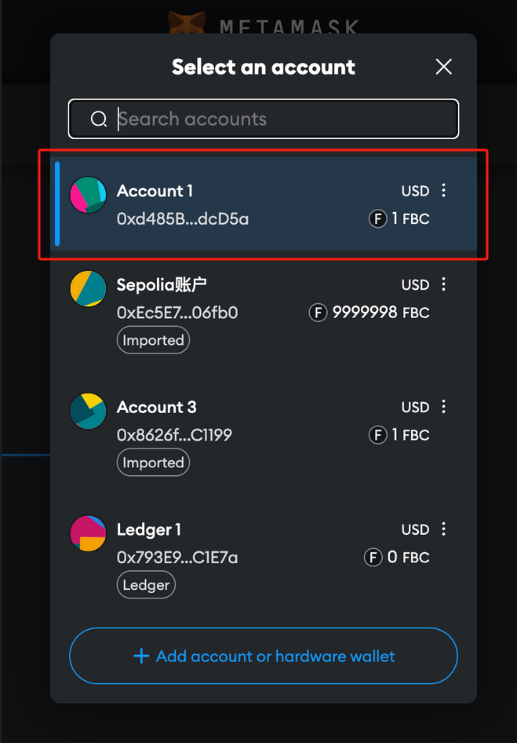
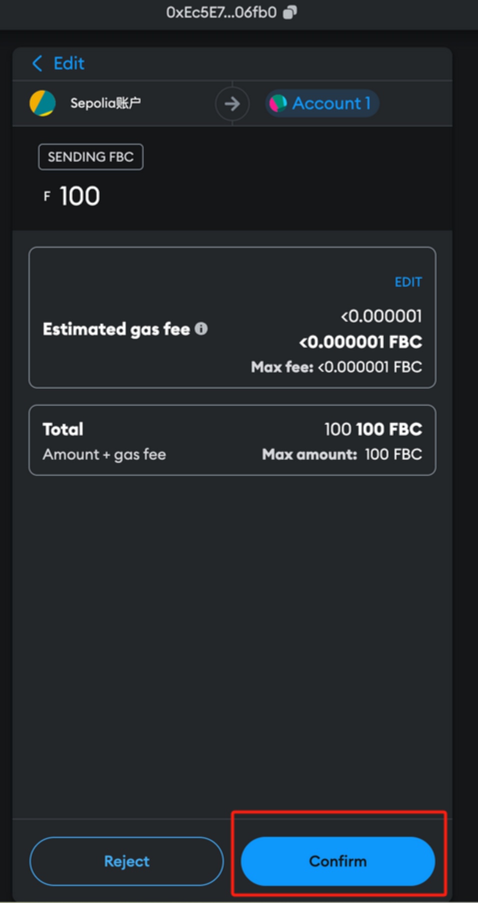

# Wallet

This section will provide an example of connecting to local FISCO BCOS network using MetaMask. Local FISCO BCOS private chain is a private chain that you can deploy on your local machine. If you are using a local FISCO BCOS private chain, please make sure you have the chain ID and RPC URL. The chain ID is the ID of the chain you are connecting to, default chain ID for FISCO BCOS is 20200. The RPC URL is the URL of the node you are connecting to, default URL is http://127.0.0.1:8545.

## Step 1. Create A Wallet

If you do not have a wallet yet, create an account using MetaMask (choose any Ethereum-compatible account type) [here](https://metamask.io/download/). For more information on MetaMask, please refer [here](https://docs.metamask.io/).

## Step 2. Connect MetaMask to the FISCO BCOS

To access the FISCO BCOS network, follow steps below to configure MetaMask:

- Open the “Network” setting, click “Add a network”:

    

- Click “Add a network manually”:

    

- Fill in required information for the FISCO BCOS network and click “Save”. If you are connecting to your local FISCO BCOS private chain, fill in the RPC URL with http://[IP]:[PORT] and Chain ID with the chain ID of your local FISCO BCOS private chain.
  - The default chain ID for FISCO BCOS is `20200` and the default RPC URL is `http://127.0.0.1:8545`. The `Network name` and `Currency symbol` are not required, you can fill in any name you like.

    

- You will see the FISCO BCOS network added to the list.

## Step 3. Get Utility Tokens

Utility tokens are required to pay for gas fees when deploying contracts or interacting with contracts on the FISCO BCOS network.

Billing Model is not availible by default, you can check this [link](./management.md) to configure the billing model.

Supply your wallet address to your local FISCO BCOS network operator to get free utility token funds.

You may find your wallet address here:

## Step 4. Trading with MetaMask Wallet

Once balance is updated, you can start trading on the FISCO BCOS network.

- To transfer tokens to another wallet address, make sure that you set a gas limit >= 210,000 WEI.

- Confirm the transaction:

- Details will be displayed confirmation:

## Explorer

You can check activities taking place on the Explorer.

For more details on how to use the explorer, please refer [here](./explorer_usage.md).

## Interact with Remix

Configure environment information in Deployment & Run Transactions tab [here](https://remix.ethereum.org/).

Select `Injected Provider - MetaMask` for `Environment`:

When initiating a deployment or calling on a contract, Remix will send the contract content to MetaMask. You will need to confirm transaction on MetaMask.

For more steps on how to deploy a contract using Remix, please refer [here](./remix_usage.md).
