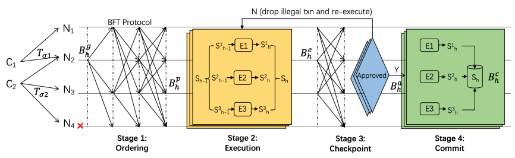

# Consensus algorithm

Consensus algorithms are used to ensure the consistency of blockchain systems. The current mainstream consensus algorithms include POW (Proof of Work), POS (Proof of Stake), BFT (Byzantine Fault Tolerance), POA (Proof of Authority), and others.

To improve system throughput and reduce transaction confirmation latency, POTOS adopts the high-performance PBFT algorithm and enhances block sealing fairness by allowing all consensus nodes to seal blocks in turns. In addition, considering the scalability of blockchain systems, POTOS will switch to the PoS-rPBFT algorithm in the near future. This document focuses on introducing these two types of consensus algorithms.

### Concepts

Node types, node IDs, node indices, and views are key concepts in the BFT based consensus algorithm. 

#### Node type

- **Leader**: Responsible for sealing transactions into blocks and advancing the consensus process. There is one and only one leader in each round of consensus. To prevent the leader from forging blocks, the leader is switched after each round of BFT consensus

- **Replica**: Responsible for block consensus, each round of consensus involves multiple Replica nodes, and the processing of each Replica node is similar.

- Observer: Responsible for obtaining the latest block from consensus nodes or replica nodes, executing and verifying the block execution results, and then storing the block locally.

Leader and Replica are collectively referred to as consensus nodes.

#### Node ID & & Node Index

To prevent malicious behavior by nodes, during the BFT consensus process, each consensus node signs the messages it sends and verifies the signatures of the received message packets. Therefore, each node maintains a pair of public and private keys. The private key is used to sign the messages sent, while the public key serves as the node ID, used for identification and signature verification.

- **Node ID:** The consensus node's public key and unique identifier are typically 64-byte binary data. Other nodes use the sender's node ID in the message packet to verify the signature of the message packet. 

- **Node index:** Considering that Node ID are long, including this field in consensus messages would consume network bandwidth. POTOS introduces a node index, where each consensus node maintains a shared consensus node list. The node index records the position of each consensus node ID in this list. When sending network message packets, it only needs to include the node index, and other nodes can retrieve the node ID from the shared consensus node list to verify the message signature.


#### Consensus View

The BFT consensus algorithm uses a view to record the consensus state of each node. Nodes in the same view maintain the same list of Leader and Replica nodes. When the Leader fails, a view-change occurs. If the view-change succeeds (at least 2f+1 nodes reach the same view), a new Leader is elected based on the new view, and the new Leader starts generating blocks. Otherwise, the view-change continues until the majority of nodes in the network (at least 2f+1) reach a consistent view.

In the POTOS system, the formula for calculating the leader Node index is as follows:

```text
leader_idx = (view + block_number) % node_num
```

## POTOS PBFT

The PBFT (Practical Byzantine Fault Tolerance) consensus algorithm achieves consensus in scenarios where a minority of nodes act maliciously (e.g., forging messages). The algorithm utilizes cryptographic algorithms such as signatures, signature verification, and hashing to ensure tamper-proof, forgery-resistant, and non-repudiable properties during message transmission. The PBFT algorithm improves upon previous work by reducing the complexity of Byzantine fault tolerance algorithms from exponential to polynomial. In a system composed of (3f+1) nodes, as long as no fewer than (2f+1) non-malicious nodes are functioning properly, the system can achieve consensus.

In addition, to address the performance issues of serial consensus in most of the current blockchain systems, POTOS proposes a **multi-stage parallel Byzantine consensus algorithm**. 

This algorithm divides the blockchain system's consensus process into multiple stages: **block batch parallel ordering consensus** and **pipeline consensus of block execution results**, with both stages able to execute in parallel. Both the block batch parallel ordering consensus and the pipeline consensus of block execution results support parallel consensus for multiple blocks.

- **The block batch parallel ordering consensus** is responsible for sorting the transactions received in the transaction pool and generating unexecuted but sorted blocks in parallel. 
- **The pipeline consensus of block execution results** performs pipeline consensus on the execution results of the blocks and commits the blocks that successfully reach consensus.




## PoS-rPBFT

To further enhance the scalability of blockchain systems, POTOS proposes the PoS-rPBFT consensus algorithm. The algorithm aims to maximize the scale of nodes while ensuring the security of the system.

The PoS-rPBFT algorithm divides consensus nodes into two categories:

- **Consensus committee**: The node executes the PBFT consensus process. Committee nodes are rotated after a certain block height based on the VRF random number and the staking weight of each consensus node.

- **Candidate consensus committee**: Verify blocks and check whether the consensus node is legal. After a certain block height, may be elected as the consensus committee nodes. The probability of rotating into a consensus committee node is determined by the node's staking weight.


The POS-rPBFT algorithm selects a specified amount of consensus committee nodes to generate blocks during each round of the consensus process. It periodically rotate the consensus nodes based on block height and the VRF random number to ensure system security. It primarily involves two system parameters:


- **feature_rpbft_epoch_sealer_num**: The number of consensus committee nodes in each round of consensus. This parameter can be dynamically configured by the system administrator using tools such as the console. 

- **feature_rpbft_epoch_block_num**: Consensus committee node rotation period. The algorithm triggers a round of consensus committee node rotation after every feature_rpbft_epoch_block_num blocks. Similarly, this parameter can be dynamically configured and modified.
