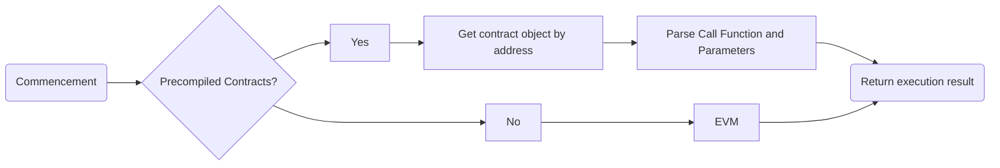

# Precompiled C++ engine

Precompiled contracts provide a way to use C++The method of writing contracts, which separates contract logic from data, has better performance than solidity contracts, and can be upgraded by modifying the underlying code。

## Precompiled contracts vs. Solidity contracts

Precompiled contracts advantages:

- Access more: Based on this framework, users can access the local DB storage state and implement any logic they need。
- Better performance: Since the precompiled contract implemented on C++, the code will be compiled in FISCO BCOS, and the underlying layer without entering the EVM for execution, which can have better performance.
- Easy to start: Developers can use C++ to develop your own precompiled contracts to quickly implement the required business logic without learning the Solidity language.

| Table Name    | Precompiled Contracts                                                                  | Solidity Contract                                      |
|:--------------|:---------------------------------------------------------------------------------------|:-------------------------------------------------------|
| Address       | Fixed address, defined in code                                                         | Determine when deploying                               |
| Contract Code | Data is stored in tables, separated from contracts, and contract logic can be upgraded | Contract variables and data are stored in the MPT tree |
| Execute       | C++Low-level execution for higher performance and parallelism                          | EVM virtual machine, serial execution                  |

## Module Architecture

The architecture of Precompiled is shown in the following figure.
The block validator determines the type based on the address of the called contract when executing the transaction。Addresses 1-4 represent Ethereum precompiled contracts, addresses 0x1000-0x10000 are C++Precompiled contracts, other addresses are EVM contracts。

## Key Processes

- When executing a precompiled contract, you first need to get the object of the precompiled contract based on the contract address。
- Each precompiled contract object implements the 'call' interface, where the specific logic of the precompiled contract is implemented。
- 'call' obtains the 'Function Selector' and parameters according to the abi code of the transaction, and then executes the corresponding logic。

## Precompiled contracts in FISCO BCOS

FISCO BCOS provides several useful precompiled contracts. These contracts are implemented in the platform itself as a native implementation, which means they are part of the FISCO BCOS node.

For embracing EVM ecology, the precompiled contracts from address 0x01 through 0x0A are the same as those in any EVM compatible blockchain. The precompiled contracts from address 0x1000 through 0xfffff are C++ precompiled contracts, which are implemented in the FISCO BCOS node.

The following table lists the precompiled contracts provided by FISCO BCOS.

| Address | Name              | Description                                                                                                                                            |
|:--------|:------------------|:-------------------------------------------------------------------------------------------------------------------------------------------------------|
| 0x01    | ecrecover         | Recover the public key from the signature and hash value                                                                                               |
| 0x02    | sha256            | Calculate the SHA256 hash value                                                                                                                        |
| 0x03    | ripemd160         | Calculate the RIPEMD160 hash value                                                                                                                     |
| 0x04    | identity          | Return the input data                                                                                                                                  |
| 0x05    | modexp            | Calculate the modular exponentiation                                                                                                                   |
| 0x06    | alt_bn128_add     | Calculate the addition of the alt_bn128 curve                                                                                                          |
| 0x07    | alt_bn128_mul     | Calculate the multiplication of the alt_bn128 curve                                                                                                    |
| 0x08    | alt_bn128_pairing | Calculate the pairing of the alt_bn128 curve                                                                                                           |
| 0x09    | blake2f           | Calculate the BLAKE2F hash value                                                                                                                       |
| 0x0A    | kzg               | Calculate the KZG proof verification to a given value at a given point. For more information, see [EIP-4844](https://eips.ethereum.org/EIPS/eip-4844). |
| 0x1000  | SystemConfig      | Configuration management of blockchain system                                                                                                          |
| 0x1001  | Table             | Accessing table contract logic                                                                                                                         |
| 0x1002  | TableManager      | Table Contract Management                                                                                                                              |
| 0x1003  | ConsensusManager  | Manage the stauts of nodes                                                                                                                             |
| 0x1005  | AuthManager       | Contract-based permission control                                                                                                                      |
| 0x1009  | KVTable           | Accessing kv table contract logic                                                                                                                      |
| 0x100a  | Crypto            | Provide cryptographic interface                                                                                                                        |
| 0x100c  | DAGTransfer       | Provide DAG Transfer Test Contract                                                                                                                     |
| 0x100e  | BFS               | BFS System Contract Interface                                                                                                                          |
| 0x100f  | Cast              | Easy way to cast solidity trival type                                                                                                                  |
| 0x1010  | Sharding          | Block sharding execution management                                                                                                                    |
| 0x1011  | Balance           | Balance of accounts management                                                                                                                         |
| 0x10001 | AuthManager       | Authority Governance Committee Contract                                                                                                                |
| 0x5003  | Paillier          | Paillier crypto interfaces                                                                                                                             |
| 0x5004  | GroupSign         | Group Signature interfaces                                                                                                                             |
| 0x5005  | RingSign          | Ring Signature interfaces                                                                                                                              |
| 0x5100  | ZKP               | ZKP System Contract                                                                                                                                    |
